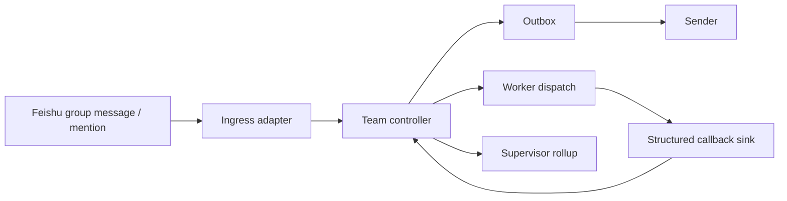
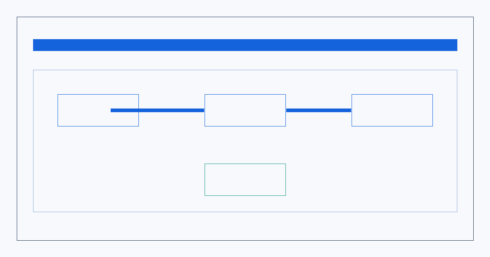

# Architecture

`OpenClaw-Feishu-Multi-Agent` 当前公开主线是 `V5.1 Hardening`。

这套架构的核心目标不是“让多个机器人都能发消息”，而是：

- 让多角色分析稳定发生
- 让状态推进由控制面决定
- 让群里消息按可预测顺序出现
- 让 supervisor 最终输出“决策型终稿”

## System Overview

Rendered overview:

## Main Principles

1. `LLM 负责内容，代码负责流程`
2. `One Team = 1 Supervisor + N Workers`
3. `teamKey` 是唯一内部隔离主键
4. worker 可以并行分析，但群里消息仍由控制面顺序发布

## Runtime Components

### 1. Ingress adapter

负责把真实飞书入站消息转成控制面可消费的 inbound event。

### 2. Team controller

负责：

- 建单
- 推进 stage
- 控制 `next_action`
- 决定什么时候允许最终统一收口

### 3. Outbox + sender

负责把控制面批准过的可见消息真正发到群里。

这里保证：

- 不重复发
- 不乱序发
- 不让 worker 自由发挥群内业务文案

### 4. Structured callback sink

worker 不能直接推进状态机。

worker 只提交结构化结果：

- `progressDraft`
- `finalDraft`
- `finalVisibleText`
- `summary`
- `details`
- `risks`
- `actionItems`

### 5. Supervisor rollup

supervisor 最终统一收口基于全量 worker 终案正文，整理成“决策型终稿”：

- `最终结论`
- `决策依据`
- `最终方案`
- `执行路线`
- `风险红线`
- `明日三件事`

## Why This Matters

和“prompt 自己决定流程”的模式相比，这套架构的优势是：

- 更稳定
- 更容易恢复
- 更容易扩群
- 更容易做测试与回归
- 更适合客户交付与长期维护
