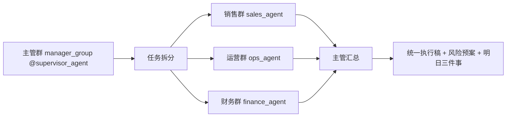

# 飞书多 Agent 主管派单与自动跨群收口交付蓝图（V3）

## 这份 V3 能给客户看到什么

这不是“多几个机器人”，而是一个可执行的 AI 组织流程：

1. 主管群一条指令触发全链路
- 主管 Agent 在管理群接到任务后，自动拆分成销售/运营/财务三个子任务。

2. 跨群派单执行
- 子任务按路由发送到对应业务群（或对应业务 Agent 会话），由各角色按边界执行。

3. 自动回收与统一收口
- 主管 Agent 拉回三方结果，输出统一执行稿：结论、冲突、方案、明日三件事、风险预案。

4. 可扩展、可审计、可回滚
- 保持 brownfield 最小改动；新增群、新增机器人、新增 Agent 都可增量扩展。

## V2.1 与 V3 的关系

- V2.1：侧重“主管群自动跨群收口”（偏汇总）。
- V3：在 V2.1 基础上新增“主管派单 -> 三群执行 -> 自动收口”（偏执行闭环）。

## V3 架构（推荐）



## 当前环境基线（按你的真实结构）

```yaml
project:
  channel: "feishu"
  mode: "brownfield-incremental"

accounts:
  - { accountId: "aoteman", botName: "奥特曼" }
  - { accountId: "xiaolongxia", botName: "小龙虾找妈妈" }
  - { accountId: "yiran_yibao", botName: "易燃易爆" }

routes:
  - { peerKind: "group", peerId: "oc_ffab0130d2cfb80f70c150918b4d4e87", accountId: "aoteman",      agentId: "sales_agent" }
  - { peerKind: "group", peerId: "oc_da719e85a3f75d9a6050343924d9aa62", accountId: "xiaolongxia",  agentId: "ops_agent" }
  - { peerKind: "group", peerId: "oc_1a3c32a99d6a8120f9ca7c4343263b24", accountId: "yiran_yibao",  agentId: "finance_agent" }
  - { peerKind: "group", peerId: "oc_84677faa225ba8a380d3721c654f17a1", accountId: "aoteman",      agentId: "supervisor_agent" }
```

## V3 关键能力开关（必须）

1. 路由：`bindings` 精确绑定 4 个群（3 业务群 + 1 主管群）。
2. 协作：`tools.agentToAgent.enabled=true` 且 `allow` 包含 4 个 agent。
3. 工具组放行：`tools.allow` 必须包含 `group:sessions`（建议同时包含 `group:messaging`）。
4. 会话派单：开启会话工具可见性，支持主管向目标会话发任务。
- 建议：`tools.sessions.visibility: "all"`（最稳妥）
5. 发送策略：确保自动发送不被策略拦截。
- 建议：`session.sendPolicy.default: "allow"`
6. 群触发稳定性：默认 `requireMention=true`，主管群/业务群演示时都 `@机器人`。

## 交付前提与权限清单

### OpenClaw 侧

- 已安装官方插件：`@openclaw/feishu`
- 现网配置可读取：`~/.openclaw/openclaw.json`
- 可执行命令：
  - `openclaw config validate`
  - `openclaw gateway restart`
  - `openclaw agents list --bindings`
  - `openclaw logs --follow`

### 飞书侧（每个机器人）

最小必需（已在你现网多数具备）：
- `im:message`
- `im:message:send_as_bot`
- `im:message:readonly`
- `im:message.group_at_msg:readonly`
- `im:message.p2p_msg:readonly`
- `im:resource`

可选（仅在要免 @ 时）：
- `im:message.group_msg`

事件订阅：
- `im.message.receive_v1`

## V3 运行机制（重点）

### A. 任务卡标准（主管派单统一格式）

```yaml
taskCard:
  taskId: "promo-2026-04-001"
  topic: "4月促销活动"
  objective: "新增付费客户80，预算<=20万，毛利率>=22%"
  constraints:
    - "不可承诺未审批折扣"
    - "库存与履约超阈值需降级"
  dueAt: "2026-03-06 18:00"
  outputFormat:
    - "结论"
    - "数据与口径"
    - "风险"
    - "下一步动作"
```

### B. 派单与收口闭环

1. 主管群触发：supervisor_agent 接任务。  
2. 拆分派单：向 sales/ops/finance 目标会话分别发送任务。  
3. 三群执行：各 agent 在各自边界输出结构化结果。  
4. 主管收口：合并三方输出，给统一执行稿。  
5. 超时补救：未回传则输出“待补数据 + 风险提示 + 临时方案”。

### C. 冷启动注意（非常关键）

首次启用 V3 前，必须先让每个业务群至少触发一次机器人（例如发送 `@机器人 /status`），让目标会话存在。否则主管派单可能找不到目标 sessionKey。

## 一次性交付主提示词（V3，可直接发 Codex）

```text
请使用 openclaw-feishu-multi-agent-deploy skill，按官方最新规范完成 V3 交付：
实现“自动跨群收口 + 主管派单 -> 三群执行 -> 主管自动收口”。

# 1) 目标
- 现网 brownfield，增量最小变更。
- 保留现有 3 条业务路由不变。
- 保持 manager 群路由到 supervisor_agent。
- 在 supervisor_agent 中启用跨 agent 协作和跨会话派单能力。

# 2) 输入
accountMappings:
- { accountId: "aoteman", appId: "cli_a923c749bab6dcba", appSecret: "<真实值>", encryptKey: "<真实值或空>", verificationToken: "<真实值或空>" }
- { accountId: "xiaolongxia", appId: "cli_a9f1849b67f9dcc2", appSecret: "<真实值>", encryptKey: "<真实值或空>", verificationToken: "<真实值或空>" }
- { accountId: "yiran_yibao", appId: "cli_a923c71498b8dcc9", appSecret: "<真实值>", encryptKey: "<真实值或空>", verificationToken: "<真实值或空>" }

agents:
- { id: "sales_agent", role: "销售咨询", systemPrompt: "你是销售 Agent。先给需求摘要，再给可执行方案与边界；不可承诺未审批折扣。" }
- { id: "ops_agent", role: "运营执行", systemPrompt: "你是运营 Agent。输出任务排期、负责人建议、依赖、风险、降级方案。" }
- { id: "finance_agent", role: "财务分析", systemPrompt: "你是财务 Agent。输出指标表与口径，标注红线与人工复核点。" }
- { id: "supervisor_agent", role: "主管派单与收口", systemPrompt: "你是主管 Agent。硬约束：必须先调用 sessions_list 定位目标会话，再完成 3 次 sessions_send（sales/ops/finance 各一次），随后再收口。若未完成任一步，首行返回 DISPATCH_INCOMPLETE，并列出缺失步骤；禁止用文本模拟派单。成功时必须输出 dispatchEvidence（目标会话、发送时间、任务ID、发送结果）。" }

routes:
- { peerKind: "group", peerId: "oc_ffab0130d2cfb80f70c150918b4d4e87", accountId: "aoteman",      agentId: "sales_agent" }
- { peerKind: "group", peerId: "oc_da719e85a3f75d9a6050343924d9aa62", accountId: "xiaolongxia",  agentId: "ops_agent" }
- { peerKind: "group", peerId: "oc_1a3c32a99d6a8120f9ca7c4343263b24", accountId: "yiran_yibao",  agentId: "finance_agent" }
- { peerKind: "group", peerId: "oc_84677faa225ba8a380d3721c654f17a1", accountId: "aoteman",      agentId: "supervisor_agent" }

# 3) 强约束
1. 先审计 ~/.openclaw/openclaw.json，输出 to_add / to_update / to_keep_unchanged。
2. 只允许改：channels.feishu、bindings、agents.list、tools.allow、tools.agentToAgent、tools.sessions、session.sendPolicy。
3. bindings 排序必须：peer+accountId 精确 > accountId > channel 兜底。
4. 开启：tools.agentToAgent.enabled=true。
5. allow 至少包含：supervisor_agent、sales_agent、ops_agent、finance_agent。
6. 设置 tools.allow，至少包含：group:sessions、group:messaging。
7. 设置 tools.sessions.visibility="all"（若现网已有更严格策略，说明风险后再最小调整）。
8. session.sendPolicy.default="allow"；如有 deny 规则，不得影响 feishu group 派单。
9. requireMention 默认 true；allowMentionlessInMultiBotGroup 默认 false。
10. 每个 peerId/accountId/agentId 必须真实存在，禁止猜测。
11. supervisor_agent 必须带“硬门禁”：未完成 sessions_list + 3 次 sessions_send 时，一律返回 `DISPATCH_INCOMPLETE`。
12. 验收输出必须包含 `dispatchEvidence`，至少 3 条（sales/ops/finance 各一条）。

# 4) 输出
1. 最小 patch（可直接应用）。
2. 完整命令：
   - 备份
   - openclaw config validate
   - openclaw gateway restart
   - openclaw agents list --bindings
   - canary 验证
   - 回滚
3. 给出“sessionKey 发现步骤”：先 warm-up，再通过日志/会话工具确认 3 个业务群会话键。
4. 给出验收模板：
   - 路由正确性
   - 主管派单是否触发
   - 三群执行是否回传
   - 主管收口质量
   - 日志证据
5. 给出 canary 自动校验命令（2 分钟窗口）：未命中 3 个目标会话即判失败。
```

## 上线步骤（人工照着做）

1. 确认四个群都已拉入对应机器人。  
2. 业务群和主管群各发一次 `@机器人 /status` 做 warm-up。  
3. 将上面的 V3 主提示词发给 Codex 生成 patch。  
4. 先备份配置，再应用 patch。  
5. 执行校验和重启：
- `openclaw config validate`
- `openclaw gateway restart`
- `openclaw agents list --bindings`
6. 在主管群做 canary 演示（见下节）。  
7. 执行 canary 自动校验（见下方命令），检查 2 分钟窗口内是否出现三条会话派发证据。  
8. 验收通过后再全量使用。

### V3 canary 自动校验命令（2 分钟窗口）

```bash
LOG="/tmp/openclaw/openclaw-$(date +%F).log"
START_LINE=$(wc -l < "$LOG")

# 现在去主管群发送 demo-v3-001 指令
sleep 120

bash skills/openclaw-feishu-multi-agent-deploy/scripts/check_v3_dispatch_canary.sh \
  --log "$LOG" \
  --start-line "$START_LINE" \
  --agents "sales_agent,ops_agent,finance_agent"
```

返回码说明：
- `0`：`DISPATCH_OK`（三会话都有派发轨迹）
- `2`：`DISPATCH_INCOMPLETE`（缺少一个或多个目标会话轨迹）

## 最佳实践测试样板（V3 专用）

### 第 1 轮：基础派单协同（推荐先跑）

在主管群发送：

```text
@奥特曼 请按 V3 执行一次跨群派单并自动收口：
任务ID：demo-v3-001
主题：4月促销活动
目标：新增付费客户80，预算<=20万，毛利率>=22%
请输出：
1) 先给三方子任务卡（销售/运营/财务）
2) 派单执行后收集三方结果
3) 统一执行方案
4) 明日三件事（含责任角色）
5) 风险预案与触发回退条件
```

预期：
1. 主管先拆任务，不直接空总结。  
2. 三群各自有执行输出（且日志中可见三会话派发轨迹）。  
3. 最终回到主管群形成统一决策稿。
4. 主管回复中包含 `dispatchEvidence`（不少于 3 条）。

### 第 2 轮：突发冲突场景（展示“真协同”）

在主管群发送：

```text
@奥特曼 请按 V3 执行一次冲突场景收口：
任务ID：demo-v3-002
背景：客户要求本周上“买二赠一”，但库存只支撑90单，预算不增加。
输出：
1) 销售/运营/财务冲突点
2) 取舍原则（优先级）
3) 本周可落地方案
4) 明日三件事
5) 回退机制
```

预期：
1. 明确冲突（目标、履约、毛利）而非泛泛建议。  
2. 给出可上线版本 + 边界条件 + 回退动作。  
3. 输出有责任角色和时间点。

## V3 验收评分（10 分）

1. 路由命中（2分）：四群均命中预期 agent。  
2. 派单执行（2分）：主管能触发三方任务，不是只在本群回答。  
3. 角色边界（2分）：销售/运营/财务不串岗。  
4. 收口质量（2分）：包含冲突、统一方案、明日三件事、风险预案。  
5. 可追溯（2分）：日志可证明派单与回传链路。  

通过线：`>=8分`。

## 常见问题（V3）

1. 主管只给模板总结，没真正派单
- 检查 `tools.agentToAgent` 是否启用且 allow 完整。
- 检查 `tools.allow` 是否包含 `group:sessions`。
- 检查 `tools.sessions.visibility` 是否允许看到目标会话。
- 检查目标群是否做过 warm-up（会话是否存在）。

2. 派单后业务群没消息
- 检查机器人是否在目标群、是否有发消息权限。
- 检查 `session.sendPolicy` 是否拦截发送。
- 检查飞书权限 `im:message:send_as_bot` 和应用发布状态。

3. 主管不知道历史上下文
- 新入群机器人默认不自动拥有历史消息上下文；先通过当前任务卡拉取最新事实。
- 必要时在业务群补一条“关键结论摘要”再触发收口。

4. 多机器人同群误触发
- 保持 `requireMention=true`。
- 多 bot 同群默认 `allowMentionlessInMultiBotGroup=false`。

## 扩展模板（新增群/新增 Agent）

```text
请使用 openclaw-feishu-multi-agent-deploy skill，在现有 V3 架构上增量扩展：
- 新增群：{ peerKind: "group", peerId: "oc_new_xxx", accountId: "<existing_or_new>", agentId: "<agent>" }
- 如新增 agent：同步更新 agents.list、tools.agentToAgent.allow。
- 如需要主管可向新群派单：确保可发现该群 sessionKey，并校验 sendPolicy 不阻断。
约束：
1) 不改稳定路由与账号。
2) 仅输出最小 patch。
3) 输出 to_add / to_update / to_keep_unchanged。
4) 给出 canary 与回滚命令。
```

## 官方交叉验证（2026-03-06）

以下结论已按官方文档交叉核对：

1. Feishu 官方通道配置与多账号、群 ID 获取、多 Agent 路由：
- https://docs.openclaw.ai/channels/feishu

2. 多 Agent 路由与 `agentToAgent` 开关：
- https://docs.openclaw.ai/zh-CN/concepts/multi-agent
- https://docs.openclaw.ai/gateway/configuration-reference

3. 跨会话派发能力（`sessions_send`、`sessions_list`、`sendPolicy`）：
- https://docs.openclaw.ai/zh-CN/concepts/session-tool

4. 飞书事件订阅与应用配置入口（由 OpenClaw Feishu 文档引用）：
- https://open.feishu.cn/document/server-docs/event-subscription-guide/introduction
- https://open.feishu.cn/document/server-docs/im-v1/message/events/message_receive
