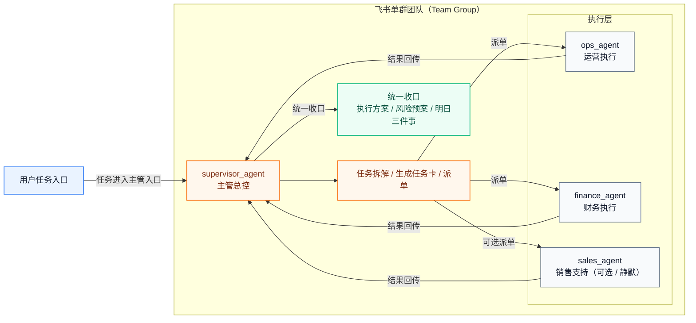

# 飞书单群高级 Agent 团队交付蓝图（V4）

## 这份 V4 要实现什么

这份蓝图不是“3 个机器人都在一个群里聊天”，而是一个真正可执行的单群团队作业模式：

1. 用户只面向主管机器人发任务
- 同一团队群里，用户默认只 `@主管机器人` 提任务。

2. 主管 Agent 负责拆解与调度
- `supervisor_agent` 先理解目标，再拆成销售、运营、财务或其他执行子任务。

3. 执行角色在同一群内协作完成
- 主管通过 `sessions_list` / `sessions_send` 把任务派给同群里的执行角色会话。
- 执行角色按边界产出结果，不抢主管角色。

4. 主管统一收口
- 最终输出统一结论、执行方案、责任分工、明日三件事、风险预案。

5. 形成“单群版一人公司”
- 外部看起来是一个群里的 AI 团队。
- 内部其实是主管编排 + 专业角色分工 + 可审计验收。

## 适用场景

- 你不想让客户在多个群之间来回切换
- 你想做一个“老板群 / 作战室”式的单群协同演示
- 你希望用户只和主管机器人对话，其余机器人作为执行角色存在
- 你希望未来继续扩展更多角色，但仍保留一个统一入口

## 先讲清楚：V4 的推荐交互规则

V4 的推荐做法不是“谁都可以在群里随便说话，所有 bot 都自动响应”，而是：

1. 用户默认只 `@主管机器人`
- 这是正式交付时最稳的入口。

2. 执行机器人默认不直接接管用户请求
- 执行角色优先响应主管派发的任务卡。
- 如果用户直接 `@执行机器人`，建议执行机器人回复“请由主管机器人统一分派”。

3. 默认保持：
- `requireMention=true`
- `allowMentionlessInMultiBotGroup=false`

原因很简单：
- 同群多 bot 免 `@` 触发很容易产生噪音、串话、重复响应和误调度。
- 官方最佳实践也更支持“明确路由 + 明确会话工具 + 明确可见性”，不支持把群聊当成无边界广播总线。

## 与 V3.1 的区别

- V3.1：主管群发任务，调度到其他业务群执行。
- V4：所有机器人都在同一个新群里，主管在同群内调度执行角色。

## 推荐拓扑（按你当前 3 个机器人现实可落地）

### 方案 A：3 个机器人 + 3 个主角色（推荐起步）

```yaml
teamGroup:
  peerKind: "group"
  peerId: "oc_f785e73d3c00954d4ccd5d49b63ef919"

visibleBots:
  - { accountId: "aoteman",      botName: "奥特曼",     role: "主管 / 总控",    agentId: "supervisor_agent" }
  - { accountId: "xiaolongxia",  botName: "小龙虾找妈妈", role: "执行 / 运营",  agentId: "ops_agent" }
  - { accountId: "yiran_yibao",  botName: "易燃易爆",   role: "执行 / 财务",   agentId: "finance_agent" }

optionalSilentAgents:
  - { id: "sales_agent", role: "销售分析 / 话术 / 商机建议" }
```

说明：
- 3 个机器人都在一个群里。
- `supervisor_agent` 绑定主管机器人。
- `ops_agent` 和 `finance_agent` 绑定另外 2 个机器人。
- `sales_agent` 可先做“静默 agent”，通过 `agentToAgent` 被主管调用，不一定一开始就绑定到可见 bot。

### 方案 B：4 角色完整版（后续升级）

```yaml
visibleBots:
  - supervisor_agent
  - sales_agent
  - ops_agent
  - finance_agent
```

适合：
- 你未来想把销售角色也做成一个独立可见机器人。

## V4 架构（推荐）



如果你的 Markdown 预览器不支持 Mermaid，可按下面的文本流程理解：

```text
用户发任务
  -> supervisor_agent（主管总控）
  -> 拆任务 / 生成任务卡 / 派单
  -> ops_agent / finance_agent / sales_agent
  -> supervisor_agent 汇总
  -> 统一收口（执行方案 / 风险预案 / 明日三件事）
```

## 官方能力边界与交叉验证结论

以下结论已基于官方文档和业内主流 manager-worker 编排实践交叉验证：

1. OpenClaw 官方 `group:sessions` 工具组提供：
- `sessions_list`
- `sessions_history`
- `sessions_send`
- `sessions_spawn`

2. `tools.sessions.visibility="all"` 允许看到全部会话，但如果 agent 运行在 sandbox 中，还要检查 `sessionToolsVisibility` 是否限制为树内会话。

3. `agentToAgent` 负责跨 agent 协作，`sessions_send` 负责跨会话派发。
- 两者不是一回事。
- V4 需要两者都开。

4. `sessions_send` 返回 `ok` 只能说明目标 agent run 已接受/完成。
- 最终群消息送达仍应视为 `best-effort`。
- 所以 V4 验收必须看派发证据，不能只看主管回了一段话。

5. Feishu 单群多 bot 场景下，推荐保持 `requireMention=true`。
- 尤其是多 bot 同群时，不建议让所有 bot 免 `@` 自由触发。

6. 官方多 agent 路由文档明确支持同群定向和 per-agent mention targeting。
- 这意味着 V4 的“主管主入口 + 执行角色从属协作”是可实现的。

7. 业内 manager-worker 最佳实践一致强调：
- 主管只做分解、派单、校验、收口
- 执行角色只做自己的专业环节
- 必须有结构化任务卡和结构化验收证据

参考来源：
- [OpenClaw Feishu Channel](https://docs.openclaw.ai/channels/feishu)
- [OpenClaw Session Tool](https://docs.openclaw.ai/session-tool)
- [OpenClaw Tools](https://docs.openclaw.ai/tools)
- [OpenClaw Multi-Agent](https://docs.openclaw.ai/multi-agent)
- [OpenAI: Building effective agents](https://openai.com/index/building-effective-agents/)

## V4 关键配置原则

1. 同一个 `peerId` 可以绑定多个 bot / agent
- 区分键是 `accountId + peerId`。

2. 用户入口只给主管机器人
- 推荐用户只 `@奥特曼`（主管 bot）。
- 文档里的 `accountId=aoteman` 只用于配置，不是群内实际 `@` 的显示名。

3. 执行角色主要通过主管派单触发
- 不建议平时让用户直接 `@ops` / `@finance` 执行任务。

4. 执行角色 systemPrompt 要有“越权拒绝”
- 若用户直接要求其统筹全局，执行角色应提示“请由主管机器人统一分派”。

5. 如果 supervisor 使用 sandbox
- `tools.sessions.visibility="all"` 不够时，要补：
  - `agents.defaults.sandbox.sessionToolsVisibility`
  - 或 `supervisor_agent.sandbox.sessionToolsVisibility`

## 你的 V4 真实配置目标（按 3 机器人单群）

```yaml
singleTeamGroup:
  peerKind: "group"
  peerId: "oc_f785e73d3c00954d4ccd5d49b63ef919"

routes:
  - { peerKind: "group", peerId: "oc_f785e73d3c00954d4ccd5d49b63ef919", accountId: "aoteman",     agentId: "supervisor_agent" }
  - { peerKind: "group", peerId: "oc_f785e73d3c00954d4ccd5d49b63ef919", accountId: "xiaolongxia", agentId: "ops_agent" }
  - { peerKind: "group", peerId: "oc_f785e73d3c00954d4ccd5d49b63ef919", accountId: "yiran_yibao", agentId: "finance_agent" }
```

可选扩展：

```yaml
hiddenOrFutureAgents:
  - { id: "sales_agent", role: "销售支持 / 商机分析 / 话术建议" }
```

## V4 必须开启的配置项

```yaml
tools:
  allow:
    - "group:fs"
    - "group:runtime"
    - "group:web"
    - "group:messaging"
    - "group:sessions"
  agentToAgent:
    enabled: true
    allow:
      - "supervisor_agent"
      - "ops_agent"
      - "finance_agent"
      - "sales_agent"
  sessions:
    visibility: "all"

session:
  sendPolicy:
    default: "allow"
```

若 supervisor 在 sandbox：

```yaml
agents:
  defaults:
    sandbox:
      sessionToolsVisibility: "all"
```

## V4 的角色提示词最佳实践

### 主管 Agent

```text
你是主管 Agent，是这个单群团队的唯一总控入口。
你的唯一正确流程是：
1) 先理解用户目标与约束；
2) 调用 sessions_list 找到本群内的执行角色会话；
3) 若 `ops_agent` / `finance_agent` 任一会话缺失，先尝试 `sessions_spawn`；若仍缺失，明确返回 warm-up 要求；
4) 仅对已存在的目标会话发独立任务卡（sessions_send）；
5) 等待回传或记录超时；
6) 汇总为统一执行稿。

硬约束：
- 禁止文本模拟派单；
- `ops_agent` 和 `finance_agent` 是必需目标，`sales_agent` 仅可选；
- 未拿到 `ops_agent` + `finance_agent` 的 `sessions_send.status=ok` 前，不得写“已派单 / 已安排 / 已分配”；
- 若未完成，首行必须返回 `DISPATCH_INCOMPLETE`，并输出 `missingTargets`、`attemptedSteps`、`nextAction`、`dispatchEvidence=[]`；
- 若会话缺失且无法 `sessions_spawn`，`nextAction` 必须是 `warmup_required`；
- 成功时首行返回 `DISPATCH_OK`，且 `dispatchEvidence` 每条至少包含 `agentId`、`sessionKey`、`runId`、`sendStatus`、`sentAt`、`evidenceSource`。
```

### 执行 Agent（运营 / 财务 / 销售）

```text
你是执行角色 Agent，不是总控主管。
你的职责是：
- 只处理自己领域的任务卡；
- 输出结构化结果；
- 明确风险、依赖和待确认项。

硬约束：
- 如果用户直接要求你统筹全部任务，先提示“请由主管机器人统一分派”；
- 未经主管授权，不得向其他执行角色发起派单或补问；
- 不越权代替主管做全局收口；
- 不擅自承诺跨部门结果；
- 输出必须包含 `toSupervisorSummary` 字段，便于主管收口。
```

## 一次性交付主提示词（V4，可直接发 Codex）

```text
请使用 openclaw-feishu-multi-agent-deploy skill，按官方最新规范完成 V4 交付：
实现“飞书单群高级 Agent 团队模式”。

目标：
- 新建 1 个团队群，拉入 3 个飞书机器人。
- 用户在该群里默认只 @主管机器人发任务。
- 主管机器人触发 supervisor_agent，自动拆解任务。
- supervisor_agent 在同群内向执行角色会话派单。
- 执行角色完成子任务后，主管统一收口。
- 整个方案必须可验收、可审计、可回滚。
- 首次上线若 worker 会话不存在，必须先做 warm-up 或 `sessions_spawn` 兜底。

输入：
- teamGroup:
  - { peerKind: "group", peerId: "oc_f785e73d3c00954d4ccd5d49b63ef919" }
- accountMappings:
  - { accountId: "aoteman", appId: "cli_a923c749bab6dcba", appSecret: "TWpD207Ri2g1Qqmw4R5YhfkPRhOokCGX", encryptKey: "", verificationToken: "" }
  - { accountId: "xiaolongxia", appId: "cli_a9f1849b67f9dcc2", appSecret: "g7dTIRe6Tz8jYzASSKTT2eBV5LGzrKDr", encryptKey: "", verificationToken: "" }
  - { accountId: "yiran_yibao", appId: "cli_a923c71498b8dcc9", appSecret: "swscrlPKYCwAehOyyoLrlesLTsuYY6nl", encryptKey: "", verificationToken: "" }
- agents:
  - { id: "supervisor_agent", role: "主管总控", systemPrompt: "你是主管 Agent。固定流程：1) 先 sessions_list；2) 若 ops_agent/finance_agent 会话缺失，先 sessions_spawn，仍缺失则返回 warmup_required；3) 仅对必需目标 ops_agent、finance_agent 完成真实 sessions_send；sales_agent 仅可选；4) 再统一收口。硬门控：未拿到 ops_agent+finance_agent 的 sendStatus=ok 前，禁止写已派单/已安排/已分配。未完成时首行必须是 DISPATCH_INCOMPLETE，并输出 missingTargets、attemptedSteps、nextAction、dispatchEvidence=[]。完成时首行返回 DISPATCH_OK，并输出 dispatchEvidence（agentId/sessionKey/runId/sendStatus/sentAt/evidenceSource）。" }
  - { id: "ops_agent", role: "运营执行", systemPrompt: "你是运营执行 Agent。只处理主管派发的运营任务；若用户直接要求统筹全局，请提示由主管机器人统一分派。未经主管授权，不得向其他执行角色发起派单或补问。输出必须包含 toSupervisorSummary。" }
  - { id: "finance_agent", role: "财务执行", systemPrompt: "你是财务执行 Agent。只处理主管派发的财务任务；若用户直接要求统筹全局，请提示由主管机器人统一分派。未经主管授权，不得向其他执行角色发起派单或补问。输出必须包含 toSupervisorSummary。" }
  - { id: "sales_agent", role: "销售支持", systemPrompt: "你是销售支持 Agent。可作为静默或未来扩展角色，由主管或其他执行角色调用；不直接接管全局任务。" }
- routes:
  - { peerKind: "group", peerId: "oc_f785e73d3c00954d4ccd5d49b63ef919", accountId: "aoteman",     agentId: "supervisor_agent" }
  - { peerKind: "group", peerId: "oc_f785e73d3c00954d4ccd5d49b63ef919", accountId: "xiaolongxia", agentId: "ops_agent" }
  - { peerKind: "group", peerId: "oc_f785e73d3c00954d4ccd5d49b63ef919", accountId: "yiran_yibao", agentId: "finance_agent" }

强约束：
1. 先读取并审计 ~/.openclaw/openclaw.json。
2. 输出 to_add / to_update / to_keep_unchanged。
3. 只允许改：channels.feishu、bindings、agents.list、tools.allow、tools.agentToAgent、tools.sessions、session.sendPolicy，以及 supervisor 必要时最小修改的 sandbox 会话可见性字段。
4. bindings 顺序必须：peer+accountId 精确 > accountId > channel 兜底。
5. tools.allow 至少包含：group:sessions、group:messaging。
6. tools.agentToAgent.enabled=true，allow 至少包含 supervisor_agent、ops_agent、finance_agent、sales_agent。
7. tools.sessions.visibility="all"。
8. session.sendPolicy.default="allow"。
9. 同群多 bot 默认 requireMention=true，allowMentionlessInMultiBotGroup=false。
10. 默认推荐：用户只 @主管机器人，执行机器人不作为主入口。
11. 若发现 sandbox 限制 supervisor 看不到目标会话，必须补齐 `sessionToolsVisibility`。
12. supervisor_agent 若未完成真实派单，必须返回 `DISPATCH_INCOMPLETE`，不得生成伪派单文本或口头“已安排”语义。
13. 若 `ops_agent` / `finance_agent` 会话缺失，必须先 `sessions_spawn`；若仍失败，明确输出 `warmup_required`，不得继续伪派单。
14. `ops_agent`、`finance_agent` 为必需成功目标；`sales_agent` 仅可选，不得作为 canary 必需条件。
15. 验收输出必须包含 `dispatchEvidence`、`missingTargets`、`attemptedSteps`、`nextAction`。
16. 验收证据优先级必须说明：`session jsonl > gateway log`。

输出要求：
1. 最小 patch。
2. 完整操作命令：
   - 备份
   - openclaw config validate
   - openclaw gateway restart
   - openclaw agents list --bindings
   - canary 验证
   - 回滚
3. 输出同群 warm-up 步骤。
4. 输出“用户使用规范”：
   - 默认只 @主管机器人
   - 不建议直接 @执行机器人
5. 输出验收模板：
   - 主管是否真实派单
   - 执行角色是否按边界工作
   - 是否有统一收口
   - 是否存在重复触发 / 串话
   - 日志证据
```

## V4 上线步骤（人工照着做）

1. 新建一个团队群。  
2. 把 3 个机器人都拉入同一个群。  
3. 在群里依次执行 warm-up：
- `@奥特曼 /status`
- `@小龙虾找妈妈 /status`
- `@易燃易爆 /status`
4. 让 Codex 用上面的 V4 主提示词生成最小 patch。  
5. 执行：
- `openclaw config validate`
- `openclaw gateway restart`
- `openclaw agents list --bindings`
6. 在团队群里只 `@主管机器人` 做 canary。  
7. 检查 supervisor 是否真实派单给同群执行角色。  
8. 看 `dispatchEvidence`、`missingTargets`、`attemptedSteps` 是否一致。
9. 若首轮提示缺少 worker 会话，先执行一次 worker warm-up，再复测。

## V4 首次上线 warm-up 与兜底

首次部署或新群首次启用时，先做这组顺序：

1. `@小龙虾找妈妈 /status`
2. `@易燃易爆 /status`
3. 确认这两个 worker 会话已落到 session 文件或日志。
4. 再 `@奥特曼` 发 `team-v4-001`。

如果主管返回 `DISPATCH_INCOMPLETE` 且 `nextAction=warmup_required`：
- 不要判定为路由失败。
- 先补 worker warm-up，再重跑同一个 `taskId` 或新 `taskId`。

## V4 推荐演示话术（客户场景）

```text
@奥特曼 请启动本群单群团队模式：
任务ID：team-v4-001
主题：为 4 月促销活动做一份可执行落地方案
要求：
1) 你先拆分任务
2) 让运营和财务角色分别执行
3) 最后由你统一收口
4) 输出统一执行方案、责任分工、明日三件事、风险预案
```

预期：
- 用户只和主管机器人对话；
- 同群内其他执行角色收到任务卡并执行；
- 最终主管给出统一收口稿。

## V4 canary 验证命令

```bash
LOG="/tmp/openclaw/openclaw-$(date +%F).log"
START_LINE=$(wc -l < "$LOG")
TASK_ID="team-v4-001"

# 现在去团队群发送 V4 演示指令
sleep 120

bash skills/openclaw-feishu-multi-agent-deploy/scripts/check_v4_1_team_canary.sh \
  --task-id "$TASK_ID" \
  --session-root "${HOME}/.openclaw/agents" \
  --log "$LOG" \
  --start-line "$START_LINE" \
  --required-agents "ops_agent,finance_agent" \
  --optional-agents "sales_agent"
```

说明：
- 这个脚本优先看 `~/.openclaw/agents/*/sessions/*.jsonl`，再看网关日志窗口。
- 若 `sales_agent` 当前还是静默 agent，不影响通过；它本来就不是 V4 默认必需目标。

## 常见失败点（V4）

1. 用户没有 `@主管机器人`
- 在多 bot 同群下，默认不建议免 `@`。

2. 执行机器人抢着回答用户
- 执行角色提示词不够硬，需要加“非主管入口拒绝”。

3. 主管只输出了一段“已分配”的文本
- 这是伪派单，必须按 `DISPATCH_INCOMPLETE` 判失败。

4. 同群看不到执行角色会话
- 先做 worker warm-up，再检查 `tools.sessions.visibility` 和 `sessionToolsVisibility`。

5. 同群太热闹，所有 bot 都被人乱 @
- 会干扰主管主入口与会话稳定性。

6. 只看 gateway log 不看 session jsonl
- 容易误判“派单没发生”或“已经成功”。
- 正式交付时应明确使用规范：默认只 @主管机器人。

## 给客户的最终定位

V4 不是“一个群里塞 3 个机器人”，而是：

- 一个单群版 AI 作战室
- 一个主管 Agent 做总控
- 多个执行角色各司其职
- 一个入口收任务
- 一个出口交结果

这是更接近“AI 一人公司 / AI 小团队”的真实交付模式。
