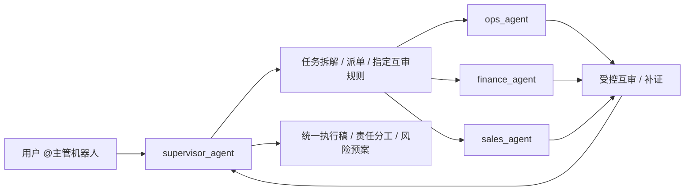

# 飞书单群高级 Agent 团队交付蓝图（V4.1）

## 这份 V4.1 要解决什么

`V4` 解决的是“单群里，主管调度执行角色”。  
`V4.1` 进一步解决的是：

- 主管可以主导多 agent 协商
- 执行角色可以在受控条件下互相复核
- 整个团队像一个小型 AI 公司一样在单群内分工协作
- 但仍保持一个清晰入口、清晰边界、清晰验收

一句话说，`V4.1` 是：

**单群团队模式 + 主管主导协商 + 执行角色有限互审。**

## V4.1 的核心理念

未来更成熟的团队 agent 模式，不是“所有 agent 自由乱聊”，而是：

1. 一个统一入口
- 用户只面向主管机器人。

2. 一个明确的 manager
- `supervisor_agent` 负责理解目标、拆任务、决定谁来做、何时互审、何时收口。

3. 多个 specialist workers
- 销售、运营、财务等执行角色专注自己领域。

4. 协商是受控的
- 执行角色之间可以互相提问、复核、补证。
- 但不能绕过主管、不能无限循环、不能越权统筹。

5. 一次最终收口
- 所有执行结果最终回到主管，由主管向用户交付一个统一答案。

## 与 V4 的区别

- V4：主管单向派单，执行角色主要各做各的。
- V4.1：在 V4 基础上，允许有限度的 agent-to-agent 协商与互审。

## V4.1 的推荐交互规则

1. 用户默认只 `@主管机器人`
- 这是群里的唯一主入口。

2. 执行机器人默认不直接接管用户请求
- 如果用户直接 `@执行机器人`，执行机器人应提示“请由主管机器人统一分派”。

3. 执行角色之间允许“有限互审”
- 仅在主管授权或任务卡要求时进行。

4. 协商必须回主管
- 任意执行角色之间的补充结论，最终仍需回到 `supervisor_agent`。

5. 默认保持：
- `requireMention=true`
- `allowMentionlessInMultiBotGroup=false`

## V4.1 架构（推荐）



## 官方能力边界与交叉验证结论

以下结论已按官方文档和主流 manager-worker 编排实践交叉验证：

1. OpenClaw 的 `agentToAgent` 允许 agent 之间协作。

2. OpenClaw 的 `group:sessions` 提供：
- `sessions_list`
- `sessions_history`
- `sessions_send`
- `sessions_spawn`

3. 所以 `V4.1` 里有两条协作链：
- `supervisor_agent -> 执行角色`
- `执行角色 -> 执行角色（有限互审）`

4. 但官方工具本质上提供的是“会话级派发能力”，不是“无边界自治组织”。
- 因此“谁能互相提问、问几轮、何时停止、谁最后收口”必须靠 systemPrompt 和验收约束控制。

5. `sessions_send` 的成功是 `best-effort` 语义。
- 所以 `V4.1` 仍然必须看 `dispatchEvidence` / `reviewEvidence` / 日志轨迹。
- 当前仓库自带的 canary 脚本主要校验“真实派单链路”，对“互审是否真的发生且是否只发生 1 轮”还不能自动严格判定，互审部分仍需结合主管输出和原始日志复核。

6. 单群多 bot 下，仍推荐主管为主入口。
- 这点在交付上比“所有 bot 自由对外响应”更稳。

参考来源：
- [OpenClaw Feishu Channel](https://docs.openclaw.ai/channels/feishu)
- [OpenClaw Session Tool](https://docs.openclaw.ai/session-tool)
- [OpenClaw Tools](https://docs.openclaw.ai/tools)
- [OpenClaw Multi-Agent](https://docs.openclaw.ai/multi-agent)
- [OpenAI: Building effective agents](https://openai.com/index/building-effective-agents/)

## V4.1 适合什么团队模式

适合：
- 老板群 / 作战室 / 决策群
- 你希望用户只对主管机器人发任务
- 你希望执行角色不仅执行，还能互相复核
- 你想做“像一人公司但分角色协作”的演示或交付

不适合：
- 你希望所有机器人都自由聊天、自由抢答
- 你不愿意做角色边界和验收约束

## 你的 V4.1 真实配置目标（按当前 3 机器人）

```yaml
singleTeamGroup:
  peerKind: "group"
  peerId: "oc_f785e73d3c00954d4ccd5d49b63ef919"

routes:
  - { peerKind: "group", peerId: "oc_f785e73d3c00954d4ccd5d49b63ef919", accountId: "aoteman",     agentId: "supervisor_agent" }
  - { peerKind: "group", peerId: "oc_f785e73d3c00954d4ccd5d49b63ef919", accountId: "xiaolongxia", agentId: "ops_agent" }
  - { peerKind: "group", peerId: "oc_f785e73d3c00954d4ccd5d49b63ef919", accountId: "yiran_yibao", agentId: "finance_agent" }
```

扩展建议：

```yaml
futureAgents:
  - { id: "sales_agent", role: "销售支持 / 商机分析 / 话术建议" }
```

## V4.1 必须开启的配置项

```yaml
tools:
  allow:
    - "group:fs"
    - "group:runtime"
    - "group:web"
    - "group:messaging"
    - "group:sessions"
  agentToAgent:
    enabled: true
    allow:
      - "supervisor_agent"
      - "ops_agent"
      - "finance_agent"
      - "sales_agent"
  sessions:
    visibility: "all"

session:
  sendPolicy:
    default: "allow"
```

若 `supervisor_agent` 或执行角色在 sandbox：

```yaml
agents:
  defaults:
    sandbox:
      sessionToolsVisibility: "all"
```

## V4.1 的角色规则

### 主管 Agent

```text
你是主管 Agent，是本群唯一总控入口。
你负责：
1) 理解目标与约束
2) 拆任务
3) 指定执行角色
4) 决定是否发起互审
5) 最终收口

硬约束：
- 禁止文本模拟派单
- 禁止在无证据时声称“已安排”
- 必须先 sessions_list，再 sessions_send
- 若未完成真实派单，首行返回 DISPATCH_INCOMPLETE
- 最终必须输出 dispatchEvidence
- 若发起互审，必须输出 reviewEvidence
```

### 执行 Agent

```text
你是执行角色 Agent，不是主管。
你的职责：
- 处理自己领域的任务卡
- 必要时按主管授权向其他执行角色补问或复核
- 输出结构化结果与风险

硬约束：
- 未经主管授权，不主动扩散式派单
- 互审最多 1 轮，避免无限协商
- 互审结论必须回主管
- 如果用户直接要求你统筹全局，提示由主管机器人统一分派
```

## V4.1 的协商边界（非常关键）

允许：
- `supervisor -> ops`
- `supervisor -> finance`
- `supervisor -> sales`
- `ops -> finance`（例如运营向财务确认预算红线）
- `finance -> ops`（例如财务要求补履约上限）
- `sales -> ops`（例如销售要求确认承接能力）

不建议默认开放：
- 任意角色无限轮次互聊
- 执行角色绕过主管直接对用户做全局承诺
- 执行角色互相派发二级团队

正式交付建议：
- 默认只允许“1 轮互审”
- 超过 1 轮必须回到主管

## 一次性交付主提示词（V4.1，可直接发 Codex）

```text
请使用 openclaw-feishu-multi-agent-deploy skill，按官方最新规范完成 V4.1 交付：
实现“飞书单群高级 Agent 团队模式 + 主管主导协商 + 执行角色有限互审”。

目标：
- 新建 1 个团队群，拉入 3 个飞书机器人。
- 用户默认只 @主管机器人发任务。
- 主管机器人触发 supervisor_agent，负责任务拆解、派单、互审编排、最终收口。
- 执行角色（运营 / 财务 / 销售支持）按边界执行。
- 当任务需要交叉校验时，允许执行角色之间做最多 1 轮有限互审。
- 任何互审结论都必须回到主管，再由主管统一对用户输出。

输入：
- teamGroup:
  - { peerKind: "group", peerId: "oc_f785e73d3c00954d4ccd5d49b63ef919" }
- accountMappings:
  - { accountId: "aoteman", appId: "cli_a923c749bab6dcba", appSecret: "TWpD207Ri2g1Qqmw4R5YhfkPRhOokCGX", encryptKey: "", verificationToken: "" }
  - { accountId: "xiaolongxia", appId: "cli_a9f1849b67f9dcc2", appSecret: "g7dTIRe6Tz8jYzASSKTT2eBV5LGzrKDr", encryptKey: "", verificationToken: "" }
  - { accountId: "yiran_yibao", appId: "cli_a923c71498b8dcc9", appSecret: "swscrlPKYCwAehOyyoLrlesLTsuYY6nl", encryptKey: "", verificationToken: "" }
- agents:
  - { id: "supervisor_agent", role: "主管总控", systemPrompt: "你是主管 Agent。必须先 sessions_list，再完成真实派单；必要时只允许 1 轮互审；最终统一收口。无证据不得声称已分配。" }
  - { id: "ops_agent", role: "运营执行", systemPrompt: "你是运营执行 Agent。只处理主管派发的运营任务；若被授权互审，可向财务或销售支持发 1 轮补问；最终必须回主管。" }
  - { id: "finance_agent", role: "财务执行", systemPrompt: "你是财务执行 Agent。只处理主管派发的财务任务；若被授权互审，可向运营发 1 轮补问；最终必须回主管。" }
  - { id: "sales_agent", role: "销售支持", systemPrompt: "你是销售支持 Agent。负责销售策略、话术、商机分析；默认不作为主入口；若被授权互审，可对运营提出承接确认。" }
- routes:
  - { peerKind: "group", peerId: "oc_f785e73d3c00954d4ccd5d49b63ef919", accountId: "aoteman",     agentId: "supervisor_agent" }
  - { peerKind: "group", peerId: "oc_f785e73d3c00954d4ccd5d49b63ef919", accountId: "xiaolongxia", agentId: "ops_agent" }
  - { peerKind: "group", peerId: "oc_f785e73d3c00954d4ccd5d49b63ef919", accountId: "yiran_yibao", agentId: "finance_agent" }

强约束：
1. 先读取并审计 ~/.openclaw/openclaw.json。
2. 输出 to_add / to_update / to_keep_unchanged。
3. 只允许改：channels.feishu、bindings、agents.list、tools.allow、tools.agentToAgent、tools.sessions、session.sendPolicy，以及 supervisor/worker 必要时最小修改的 sandbox 会话可见性字段。
4. bindings 顺序必须：peer+accountId 精确 > accountId > channel 兜底。
5. tools.allow 至少包含：group:sessions、group:messaging。
6. tools.agentToAgent.enabled=true，allow 至少包含 supervisor_agent、ops_agent、finance_agent、sales_agent。
7. tools.sessions.visibility="all"。
8. session.sendPolicy.default="allow"。
9. 同群多 bot 默认 requireMention=true，allowMentionlessInMultiBotGroup=false。
10. 默认用户只 @主管机器人，执行机器人不是主入口。
11. 若 supervisor 或 worker 因 sandbox 看不到目标会话，必须补齐 `sessionToolsVisibility`。
12. supervisor 未完成真实派单时，必须返回 `DISPATCH_INCOMPLETE`。
13. 执行角色互审最多 1 轮；不得无限循环协商。
14. 执行角色互审结论必须回主管。
15. 如果当前只有 `supervisor_agent`、`ops_agent`、`finance_agent` 三个已落地可见角色，则 `sales_agent` 仅作为可选隐藏角色，不得在 canary 中强制要求必须出现会话轨迹。
16. 验收输出必须同时包含：
   - dispatchEvidence
   - reviewEvidence（若发生互审）
17. 若没有真实互审，不得伪造 `reviewEvidence`。

输出要求：
1. 最小 patch。
2. 完整操作命令：
   - 备份
   - openclaw config validate
   - openclaw gateway restart
   - openclaw agents list --bindings
   - canary 验证
   - 回滚
3. 输出群内使用规范：
   - 用户默认只 @主管机器人
   - 执行机器人只做执行与有限互审
4. 输出验收模板：
   - 主管是否真实派单
   - 执行角色是否按边界工作
   - 是否发生受控互审
   - 是否最终回主管收口
   - 是否有重复触发 / 越权 / 无限循环
   - 日志证据
```

## V4.1 上线步骤（人工照着做）

1. 新建一个团队群。  
2. 把 3 个机器人都拉入同一个群。  
3. 在群里依次做 warm-up：  
- `@奥特曼 /status`
- `@小龙虾找妈妈 /status`
- `@易燃易爆 /status`
4. 用上面的 V4.1 主提示词让 Codex 生成 patch。  
5. 执行：
- `openclaw config validate`
- `openclaw gateway restart`
- `openclaw agents list --bindings`
6. 在群里只 `@主管机器人` 做 canary。  
7. 验证 supervisor 是否完成真实派单。  
8. 验证若发生互审，是否控制在 1 轮内并最终回主管。  
9. 互审是否真实发生，需结合主管输出中的 `reviewEvidence` 和原始日志复核，不要只看 canary 脚本返回值。  

## V4.1 推荐演示话术

```text
@奥特曼 请启动本群高级团队模式：
任务ID：team-v4-1-001
主题：为 4 月促销活动做一份可执行方案
要求：
1) 你先拆分任务
2) 让运营与财务分别执行
3) 如果两方结论冲突，请组织 1 轮互审
4) 最终由你统一收口
5) 输出执行方案、责任分工、明日三件事、风险预案
```

预期：
- 用户只对主管说话
- 主管派单给执行角色
- 必要时执行角色互相复核 1 轮
- 最后主管统一输出

## V4.1 canary 验证命令

```bash
LOG="/tmp/openclaw/openclaw-$(date +%F).log"
START_LINE=$(wc -l < "$LOG")
TASK_ID="team-v4-1-001"

# 现在去团队群发送 V4.1 演示指令
sleep 120

bash skills/openclaw-feishu-multi-agent-deploy/scripts/check_v3_dispatch_canary.sh \
  --log "$LOG" \
  --start-line "$START_LINE" \
  --task-id "$TASK_ID" \
  --agents "ops_agent,finance_agent"
```

说明：
- 这是按你当前“3 个可见机器人里只有运营 / 财务作为默认执行角色”写的默认值。
- 如果你后续把 `sales_agent` 也做成可见且可派发角色，再把 `--agents` 改成 `"ops_agent,finance_agent,sales_agent"`。

## 常见失败点（V4.1）

1. 用户直接乱 @执行机器人
- 会打穿主管主入口规则。

2. 执行角色开始无限互聊
- 提示词没限制“最多 1 轮互审”。

3. 主管没有真实派单，只写了“我已安排”
- 这属于伪派单，必须判失败。

4. 执行角色互审完没有回主管
- 最终会导致收口责任丢失。

5. 同群过于热闹导致多 bot 争抢触发
- 保持 `requireMention=true`，并明确使用规范。

## 给客户的最终定位

`V4.1` 不是“一个群里塞多个机器人”，而是：

- 一个单群版 AI 小团队
- 一个主管 Agent 做总控与协商编排
- 多个执行角色分工干活
- 必要时有限互审
- 最终统一收口交付

这是更接近未来团队 agent 形态的单群模式。
