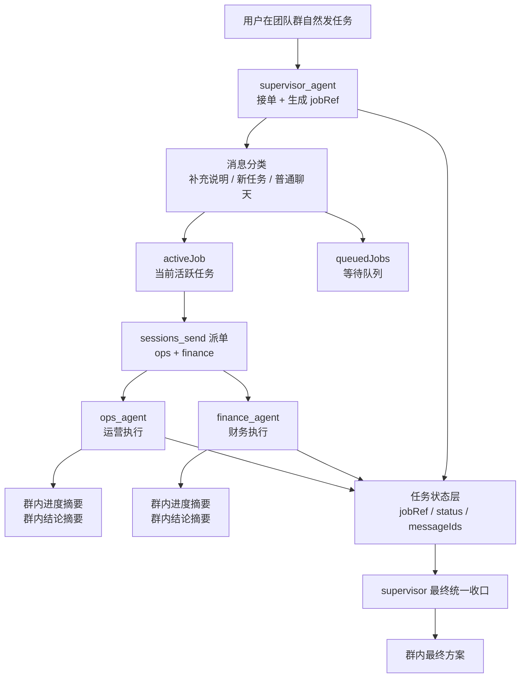

# 飞书单群高级 Agent 团队交付蓝图（V4.3 生产版）

> 当前推荐落地版本已升级为 `V4.3.1`。本文件保留为基础蓝图；如果你要真实长期上线，请优先使用 [codex-prompt-templates-v4.3.1-single-group-production.md](/Volumes/soft/13-openclaw%20安装部署/3-openclaw-mulit-agents-skill/feishu-openclaw-multi-agent/OpenClaw-Feishu-Multi-Agent/skills/openclaw-feishu-multi-agent-deploy/references/codex-prompt-templates-v4.3.1-single-group-production.md)。

## 这份 V4.3 解决什么问题

`V4.2.1` 已经把单群模式的两件关键事跑通：

- 主管真实派单
- worker 在群里真实发可见消息

但它仍然偏“演示/PoC 友好”，还不适合直接给真实客户长期使用。核心原因有三个：

1. 测试和排障依赖人工输入 `taskId`
2. 同一群里多轮、多用户、多任务并发时，单靠 transcript 容易串任务
3. supervisor 是否收口，过度依赖会话上下文，而不是显式状态

`V4.3` 的目标，就是把单群模式升级为真正的生产交付版：

- 用户自然说话，不需要自己写 `taskId`
- supervisor 自动生成内部 `jobRef`
- 同一个团队群默认只有一个活跃任务，其他任务进入队列
- 新消息先做分类：补充说明 / 新任务 / 普通聊天
- worker 继续在群里真实发进度与结论摘要
- supervisor 最终基于状态表完成统一收口

一句话：

**V4.3 = 单群可见协作 + 内部任务编号 + 活跃任务队列 + 外部状态层 + 生产级收口。**

## 与 V4.2.1 的区别

- `V4.2.1`：用户可手工提供 `taskId`，适合演示和链路排障。
- `V4.3`：`taskId` 不再暴露给最终用户，改由 supervisor 自动生成内部 `jobRef`。
- `V4.2.1`：主要靠 session transcript + messageId 验证。
- `V4.3`：增加显式状态层，以 `jobRef` 追踪整个任务生命周期。
- `V4.2.1`：更像高级演示版。
- `V4.3`：更像真实上线版。

## 为什么生产环境不该要求用户输入 taskId

真实客户不会接受每次都先写：

```text
任务ID：team-v4-2-025
```

这会直接带来三类问题：

1. 使用门槛高，用户容易输错或忘记输
2. 同群多人协作时，编号容易混乱
3. 真实系统的稳定性不应依赖“用户是否会写一个技术字段”

生产版正确做法是：

- 用户自然发任务
- supervisor 自动生成内部 `jobRef`
- `jobRef` 用于状态表、日志、worker 完成包、审计与回滚
- 如有必要，可以在主管首条消息里显示短编号，但它是系统生成的，不是用户手输的前提条件

示例：

```text
用户：@奥特曼 帮我做一份 4 月促销执行方案，运营和财务都参与。
主管：已接单，内部编号 TG-20260307-001，正在分派给运营与财务。
```

## V4.3 架构（推荐）



## 生产版核心原则

### 1. 用户自然输入，系统内部生成 jobRef

用户不输入 `taskId`。supervisor 负责：

1. 判断这是不是一个新任务
2. 若是新任务，生成新的 `jobRef`
3. 若不是新任务，判断它是当前任务补充说明还是普通聊天

推荐 `jobRef` 规则：

```text
TG-YYYYMMDD-序号
```

例如：

```text
TG-20260307-001
```

要求：

- 同一团队群内唯一
- 便于日志检索
- 可映射到状态表主键

### 2. 单群只允许一个活跃任务

这是 `V4.3` 最关键的生产规则。

同一团队群里，默认只允许一个 `activeJob`：

- `active`：正在执行或等待收口
- `queued`：新任务入队等待
- `done`：已完成
- `failed`：失败待人工介入
- `cancelled`：被明确取消

好处：

- 避免 supervisor 把多个任务上下文混在同一个群 session 里
- 避免 worker 把上一条任务的结果误发到下一条任务
- 让“补充说明”和“新任务”有清晰分界

### 3. 新消息必须先做分类

supervisor 不能把所有新消息都当成新任务。

必须先做三分类：

1. `append_to_active_job`
- 当前活跃任务的补充说明
- 例如：
  - “预算上限改成 18 万”
  - “再补一个直播渠道方案”

2. `enqueue_new_job`
- 与当前任务无关，是新的独立任务
- 当前任务未结束时，只入队，不立即并行开启

3. `normal_chat`
- 不是任务，不进派单链

### 4. 控制面与展示层继续分离

`V4.3` 保留 `V4.2.1` 的工程判断：

- 控制面：`sessions_send` / `sessions_history`
- 展示层：worker 显式调用 `message` 工具发群消息

公开群里机器人互相 `@` 可以继续保留，但只能做观感增强，不能当成正确性依据。

### 5. 最终收口必须以状态表为准

supervisor 不再只靠 transcript 猜测“是不是完成了”。

只有当 `ops` 和 `finance` 都回写完整完成包，且状态表中满足：

- `ops_status = done`
- `finance_status = done`
- `ops_progress_message_id` 存在
- `ops_final_message_id` 存在
- `finance_progress_message_id` 存在
- `finance_final_message_id` 存在

才允许最终收口。

## 外部状态层：推荐实现

### 默认推荐：SQLite

生产上最稳的起步方案是 SQLite。

原因：

- 单机部署简单
- 不引入新的基础设施
- 易于备份和排障
- 比纯 transcript 更可控

推荐文件：

```text
~/.openclaw/state/team_jobs.db
```

建议建表 SQL 见：

- [v4-3-job-registry.example.sql](../templates/v4-3-job-registry.example.sql)

### 可选：飞书多维表格

如果客户希望：

- 业务人员直接看任务面板
- 在飞书里可视化看到任务状态
- 非技术人员也能查看 active/queued/done

可把同样的字段映射到飞书多维表格。

但工程上仍建议：

- 先用 SQLite 跑通
- 再把状态镜像到多维表格

不要一开始就把多维表格当唯一状态源。

## 推荐状态字段

### jobs 主表

- `job_ref`
- `group_peer_id`
- `requested_by`
- `source_message_id`
- `title`
- `status`
- `queue_position`
- `created_at`
- `updated_at`
- `closed_at`

### job_participants

- `job_ref`
- `agent_id`
- `account_id`
- `role`
- `status`
- `dispatch_run_id`
- `dispatch_status`
- `progress_message_id`
- `final_message_id`
- `summary`
- `completed_at`

### job_events

- `job_ref`
- `event_type`
- `actor`
- `payload_json`
- `created_at`

## 推荐运行策略

### A. 主管接单阶段

1. 接收用户自然语言
2. 分类：补充 / 新任务 / 普通聊天
3. 若是新任务：生成 `jobRef`
4. 先在群里公开回复一条接单消息
5. 写入状态表：`jobs.status = active`

主管首条消息示例：

```text
【主管已接单｜TG-20260307-001】任务已受理，正在分配给运营与财务，请稍候查看执行进度。
```

### B. worker 执行阶段

worker 详细任务必须做三件事：

1. 先群发进度摘要
2. 再群发最终结论摘要
3. 再回 supervisor 一个结构化完成包

这里必须额外加一条硬门控：

- 没有拿到**两个真实 messageId**，禁止发送 `COMPLETE_PACKET`
- 若进度摘要或结论摘要任一没有真实 `messageId`，worker 只能回：

```text
WORKFLOW_INCOMPLETE|jobRef=<jobRef>|agent=<agentId>|reason=<原因>
```

这里的“真实 messageId”指的是 `message` 工具成功返回的真实值，不接受：

- 模型自己编的占位值
- 旧任务 messageId 的复制粘贴
- 没有真实群发证据时的伪造字段

完成包最少字段：

```text
COMPLETE_PACKET
jobRef: TG-20260307-001
agentId: ops_agent
status: done
progressMessageId: om_xxx
finalMessageId: om_xxx
toSupervisorSummary: ...
detailReady: true
```

### C. supervisor 收口阶段

supervisor 不要只查 transcript 最后一条，而要：

1. 查状态表是否两边都 `done`
2. 查 messageId 是否齐全
3. 若双方结论冲突，再组织 1 轮互审
4. 互审完成后再发最终统一方案

## V4.3 对多次发消息的处理规则

### 场景 1：当前任务未结束，用户补充要求

例子：

```text
再补一个直播渠道方案
```

处理：

- 识别为 `append_to_active_job`
- 不新建 `jobRef`
- 更新当前活跃任务状态
- 由 supervisor 决定是否重新派发给对应 worker

### 场景 2：当前任务未结束，用户发了新的独立任务

例子：

```text
再帮我起草 5 月预算看板
```

处理：

- 识别为 `enqueue_new_job`
- 新建新的 `jobRef`
- 但先放入队列，不立即和当前任务并行搅在一起
- 主管可回：

```text
已记录为下一个任务（TG-20260307-002），当前任务完成后自动开始。
```

### 场景 3：用户只是问一句状态

例子：

```text
现在做到哪了？
```

处理：

- 识别为 `normal_chat` 或 `query_active_job_status`
- 直接读状态表回状态
- 不新建任务

## OpenClaw 配置侧建议

### 1. 仍然使用官方插件路线

- `match.channel = "feishu"`
- 官方插件：`@openclaw/feishu`

### 2. 单群 session 要显式设置 reset 策略

原因：群 session 会复用。生产环境不应长期累积到一个永不刷新的 transcript。

推荐：

```json
{
  "session": {
    "reset": { "mode": "daily", "atHour": 4, "idleMinutes": 120 },
    "resetByType": {
      "group": { "mode": "idle", "idleMinutes": 120 }
    },
    "resetTriggers": ["/new", "/reset"]
  }
}
```

### 3. 仍然保留 V4.2.1 的展示层规则

- worker 进度摘要和结论摘要必须显式 `message`
- 不依赖 announce
- `messageId` 必须进入完成包和状态表

### 4. 控制面继续用 V4.2.1 的成熟路径

- `sessions_send`
- `sessions_history`
- 固定 sessionKey：

```text
agent:<agentId>:feishu:group:<peerId>
```

### 5. 团队群首次上线要做一次性 WARMUP

`V4.3` 单群生产版必须把 `WARMUP` 视为**一次性上线前置**，不是每次任务都要求用户手动做。

原因很直接：

- worker 的 team group session 在新群里并不会天然存在
- 若没有这层 session，supervisor 首轮派单容易出现 `No session found`、伪成功或直接卡住

所以正式上线前，运营与财务机器人各做一次：

```text
@运营机器人 WARMUP
@财务机器人 WARMUP
```

预期响应：

- `READY_FOR_TEAM_GROUP|agentId=ops_agent`
- `READY_FOR_TEAM_GROUP|agentId=finance_agent`

只要 session 已建好，后续日常真实使用就不需要重复 warm-up。  
只有以下情况才需要重新做一次：

- 新建团队群
- 清空 team session / transcript
- 重装或重建 OpenClaw 环境

## 一次性交付主提示词（V4.3，可直接发 Codex）

```text
请使用 openclaw-feishu-multi-agent-deploy skill，按官方最新规范完成 V4.3 单群生产版交付。

目标：
- 保留单群高级团队模式。
- 用户在飞书群里自然发任务，不要求手写 taskId。
- supervisor_agent 自动生成内部 jobRef（如 TG-20260307-001）。
- 同一个团队群默认只允许一个 activeJob；新任务进入 queuedJobs，补充说明归并到当前 activeJob。
- ops_agent / finance_agent 仍需在群里显式发 2 条消息：进度摘要 + 最终结论摘要。
- supervisor_agent 必须在收齐两边 COMPLETE_PACKET 后最终统一收口。
- 状态不再只依赖 transcript，必须落到一个外部状态层（默认 SQLite，可选飞书多维表格镜像）。

固定输入：
- teamGroup:
  - { peerKind: "group", peerId: "oc_f785e73d3c00954d4ccd5d49b63ef919" }
- accountMappings:
  - { accountId: "aoteman", appId: "cli_a923c749bab6dcba", appSecret: "TWpD207Ri2g1Qqmw4R5YhfkPRhOokCGX", encryptKey: "", verificationToken: "" }
  - { accountId: "xiaolongxia", appId: "cli_a9f1849b67f9dcc2", appSecret: "g7dTIRe6Tz8jYzASSKTT2eBV5LGzrKDr", encryptKey: "", verificationToken: "" }
  - { accountId: "yiran_yibao", appId: "cli_a923c71498b8dcc9", appSecret: "swscrlPKYCwAehOyyoLrlesLTsuYY6nl", encryptKey: "", verificationToken: "" }
- agents:
  - { id: "supervisor_agent", role: "主管总控" }
  - { id: "ops_agent", role: "运营执行" }
  - { id: "finance_agent", role: "财务执行" }
- routes:
  - { peerKind: "group", peerId: "oc_f785e73d3c00954d4ccd5d49b63ef919", accountId: "aoteman",     agentId: "supervisor_agent" }
  - { peerKind: "group", peerId: "oc_f785e73d3c00954d4ccd5d49b63ef919", accountId: "xiaolongxia", agentId: "ops_agent" }
  - { peerKind: "group", peerId: "oc_f785e73d3c00954d4ccd5d49b63ef919", accountId: "yiran_yibao", agentId: "finance_agent" }

约束：
1) 先读取并审计 ~/.openclaw/openclaw.json。
2) 输出 to_add / to_update / to_keep_unchanged。
3) 只做 brownfield 最小 patch。
4) 不要求用户手工输入 taskId；若用户未给编号，supervisor 必须自动生成内部 jobRef。
5) 同群只允许 1 个 activeJob；新任务必须先进入队列，或被识别为当前任务补充说明。
6) 必须给出 SQLite 任务状态层落地方案；如用户要求飞书多维表格，再额外给出镜像字段。
7) worker 仍需显式调用 message 工具群发两条摘要：progress + final。
8) 没有两个真实 messageId 时，worker 只能回 `WORKFLOW_INCOMPLETE`，不得伪造 `progressMessageId` / `finalMessageId`。
9) worker 回 supervisor 的 COMPLETE_PACKET 必须至少包含：jobRef、agentId、status、progressMessageId、finalMessageId、toSupervisorSummary、detailReady。
10) supervisor 只有在 ops + finance 都完成 COMPLETE_PACKET 后，才允许最终统一收口。
11) 配置中显式补充 group session reset 策略，避免旧 transcript 长期污染。
12) 上线步骤里显式加入一次性 `WARMUP` 前置，不要把它写成每次任务都要做。
13) 输出完整操作命令：备份、validate、restart、agents list、canary、回滚。
14) 最后输出一份“真实用户使用示例”：不写 taskId，只自然发任务；再输出系统内部 jobRef 如何生成与追踪。
```

## 推荐模板：真实用户使用示例

### 用户视角

```text
@奥特曼 帮我做一份 4 月促销执行方案，运营和财务都参与。
```

### 群里预期顺序

1. 主管：

```text
【主管已接单｜TG-20260307-001】任务已受理，正在分配给运营与财务。
```

2. 运营：

```text
【运营进度｜TG-20260307-001】已接单，正在输出节奏、渠道、排期、KPI 与风险预案。
```

3. 财务：

```text
【财务进度｜TG-20260307-001】已接单，正在输出预算上限、ROI 三线、现金流与止损规则。
```

4. 运营：

```text
【运营结论｜TG-20260307-001】建议采用两阶段促销：预热期 + 冲刺期；重点渠道为社群、私域和直播；首周排期与 KPI 已形成。
```

5. 财务：

```text
【财务结论｜TG-20260307-001】预算建议封顶 20 万，毛利率底线 22%，ROI 低于 1.5 的渠道不放量，现金流按周复核。
```

6. 主管：

```text
【主管收口｜TG-20260307-001】
统一执行方案：...
责任分工：...
明日三件事：...
风险预案：...
```

## 验收标准（V4.3）

1. 用户可不输入 `taskId`，仍能正常起任务
2. supervisor 自动生成 `jobRef`
3. 同群连续两次独立任务时，第二个任务进入队列，不与第一个串线
4. 用户补充说明不会错误新建第二个任务
5. 团队群首次上线前，每个 worker 只需做一次 `WARMUP`，后续日常使用不需要重复 warm-up
6. ops / finance 都有：
- 进度消息
- 结论消息
- 完整完成包
7. 完整完成包里的 `progressMessageId` / `finalMessageId` 必须是真实群消息 ID，伪造值一律判失败
8. supervisor 最终收口基于状态表完成，而不是只靠 transcript 猜测
9. 可通过 `jobRef` 在日志、状态表、worker 完成包中串起全链路证据

## 这一版的定位

- `V4.2.1`：单群可见协作演示版
- `V4.3`：单群生产版蓝图

如果你是给客户正式长期上线，优先按 `V4.3` 设计；
如果你是做现场演示或 PoC，`V4.2.1` 仍然是更快可跑通的版本。
