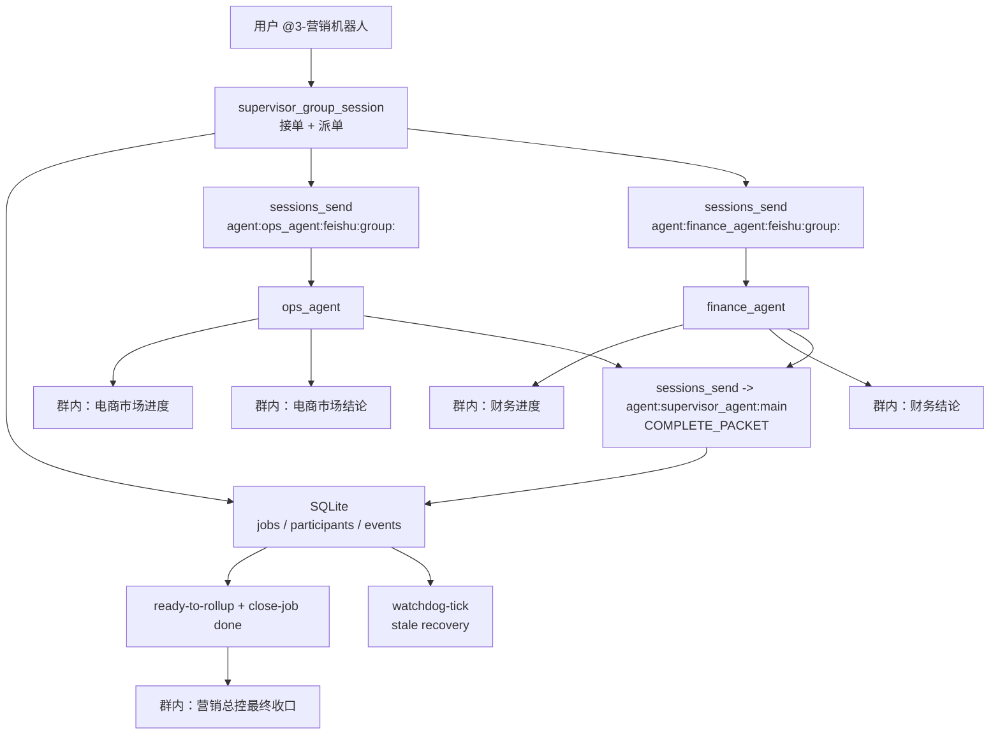

# V4.3.1-C1.0 单群生产稳定版（客户定制版）

## 这版已经验证了什么

`V4.3.1` 已经在真实 Feishu 单群里验证通过：

1. 用户只需要 `@3-营销机器人` 自然语言发任务，不需要手写 `taskId`
2. `supervisor_agent` 自动生成内部 `jobRef`，并写入 SQLite 状态层
3. `ops_agent` 与 `finance_agent` 在群里真实发可见消息，而不是只在内部 session 执行
4. `supervisor_agent` 最终自动统一收口，并把任务推进到 `done`
5. 群里不再泄漏 `ACK_READY / REPLY_SKIP / COMPLETE_PACKET` 这类内部协议

真实验收样板：
- `jobRef`: `TG-20260307-031`
- `status`: `done`
- `ops_progress`: `om_x100b55f5a7482cb0c34ce9dee645486`
- `ops_final`: `om_x100b55f5a74660a4c4f55650cc2fa81`
- `finance_progress`: `om_x100b55f5a57560b0b27e52c4be5a996`
- `finance_final`: `om_x100b55f5a50d34a4b2cce0ae416508c`
- `supervisor_final`: `om_x100b55f5beb1a908b3df8e78d8a7bc5`
- canary 输出：`V4_3_CANARY_OK`

## 当前最新生产配置快照（客户 C1.0 定制值）

以下内容基于当前真实跑通的 `V4.3.1` 生产配置改写为客户 C1.0 定制值；机器人账号与团队群 `peerId` 都已经按当前客户环境的真实值填入。

### 运行环境

- 平台：`linux`
- OpenClaw 版本：`2026.3.2`
- 配置文件：`~/.openclaw/openclaw.json`
- 主状态库：`~/.openclaw/workspace-supervisor_agent/.openclaw/team_jobs.db`
- hidden main session：`agent:supervisor_agent:main`
- 团队群 `peerId`：`oc_426bc13db95838b2aa9a327a20ee71ea`

### 机器人与账号

- 主管机器人：`marketing-bot`（显示名：`3-营销机器人`）
  - `appId`: `cli_a926a086e9389cba`
  - `appSecret`: `LLq6LJOoeBJpinNbD2Uv9fZfuHQTa4ql`
  - `职责聚合`: `营销专家 + 文案专家 + 销售专家`
- 电商市场机器人：`ecom-market-bot`（显示名：`3-电商市场机器人`）
  - `appId`: `cli_a926a17fd0b8dcc4`
  - `appSecret`: `qoQKYyCNf5chwPhA0YFxccw6PbXL3aOt`
  - `职责聚合`: `市场分析专家 + 电商线上运营专家`
- 财务机器人：`default`（当前 OpenClaw accountId 未改名；显示名建议按 `3-财务机器人` 理解）
  - `appId`: `cli_a92123297f78dcb0`
  - `appSecret`: `Nx9HJCGx6pRpg50AyGwp4Xl4z32qjbHu`
  - `职责聚合`: `财务专家`

### Agent 与绑定

- `supervisor_agent` -> `accountId=marketing-bot` -> `peerId=oc_426bc13db95838b2aa9a327a20ee71ea`
- `ops_agent` -> `accountId=ecom-market-bot` -> `peerId=oc_426bc13db95838b2aa9a327a20ee71ea`
- `finance_agent` -> `accountId=default` -> `peerId=oc_426bc13db95838b2aa9a327a20ee71ea`

### 当前客户环境已采集结果

- 当前 3 个机器人已经被拉进同一个团队群：`oc_426bc13db95838b2aa9a327a20ee71ea`
- 当前真实 `accountId` 分别是：`marketing-bot`、`ecom-market-bot`、`default`
- 当前审计结果显示：`sameGroupForThreeBots=true`、`supervisorSessionReady=true`
- 当前审计结果同时显示：`opsSessionReady=false`、`financeSessionReady=false`
- 这意味着：首次部署或迁移到该群后，仍然必须执行一次 `WARMUP`，让电商市场与财务两个 worker 生成独立 team session
- 财务机器人当前 `accountId` 仍是 `default`，这是客户现网真实值；为了减少首次交付风险，C1.0 先保留该值，不在首轮交付中强行改名

### mentionPatterns

营销总控入口当前使用：

```json
{
  "mentionPatterns": ["@3-营销机器人", "3-营销机器人", "@营销机器人", "营销机器人", "营销总控"]
}
```

### 关键运行参数

```json
{
  "tools": {
    "allow": [
      "group:fs",
      "group:runtime",
      "group:web",
      "group:automation",
      "group:ui",
      "group:messaging",
      "group:sessions"
    ],
    "agentToAgent": {
      "enabled": true,
      "allow": ["supervisor_agent", "ops_agent", "finance_agent"]
    },
    "sessions": { "visibility": "all" }
  },
  "session": {
    "sendPolicy": { "default": "allow" },
    "resetByType": {
      "group": { "mode": "idle", "idleMinutes": 1440 }
    },
    "resetTriggers": ["/reset", "/new"],
    "agentToAgent": { "maxPingPongTurns": 0 }
  }
}
```

## C1.0 客户角色映射

当前客户只有 3 个飞书机器人，但希望覆盖 6 类专家能力。为了保持和已验证的 `V4.3.1` 生产架构完全一致，C1.0 采用“3 机器人聚合 6 专家角色”的设计：

1. `supervisor_agent` / 营销机器人：聚合 `营销专家 + 文案专家 + 销售专家`，负责统一接单、任务拆分、营销策略收口、文案方向判断和销售推进建议。
2. `ops_agent` / 电商市场机器人：聚合 `市场分析专家 + 电商线上运营专家`，负责市场洞察、竞品分析、商品与渠道策略、店铺节奏、投放与运营动作。
3. `finance_agent` / 财务机器人：保持 `财务专家` 单一职责，负责预算、毛利、ROI、库存与现金流约束。

这样做的原因：
- 不改底层脚本对 `supervisor_agent / ops_agent / finance_agent` 的稳定约定；
- 继续复用 `hidden main session + SQLite + 6 类群内消息` 的已验证链路；
- 让客户看到的仍然是“营销总控 + 电商市场 + 财务”三角色协同，但内部覆盖营销、文案、市场分析、销售、电商运营、财务六类能力。

## 适用场景

适合：
- 一个飞书团队群里长期运行 1 个营销总控机器人 + 2 个执行机器人
- 用户只希望自然说话，不希望理解 `taskId / jobRef / WARMUP`
- 既要群里看起来像团队在协作，也要有生产级可恢复能力

不适合：
- 真正跨多个业务群并行执行：优先用 `V3.1`
- 不接受 SQLite 状态层：不建议上生产

## 平台兼容策略

| 平台 | 推荐级别 | service manager | 说明 |
|---|---|---|---|
| `Linux` | 正式推荐 | `systemd --user` | 当前最稳的主路线 |
| `macOS` | 正式推荐 | `launchd` / `LaunchAgent` | 与 Linux 共用同一套协议和 SQLite |
| `Windows + WSL2` | 正式推荐 | 复用 Linux 路线 | 推荐启用 `systemd` |
| `Windows 原生` | 非默认路线 | 需单独评估 | 不默认承诺等价支持 |

平台原则：
1. `WARMUP`、`v431_single_group_canary.py`、SQLite 状态层、群内 6 类可见消息规则在三条推荐路线中保持一致。
2. 平台差异只体现在 watchdog 托管、service manager 命令和运维 SOP。
3. Windows 客户默认按 `WSL2` 交付；如果客户坚持原生 Windows，需要额外记录偏差。

## 快速启动命令（新机器最小闭环）

先初始化 SQLite：

```bash
python3 skills/openclaw-feishu-multi-agent-deploy/scripts/v431_single_group_runtime.py \
  --db ~/.openclaw/workspace-supervisor_agent/.openclaw/team_jobs.db \
  init-db
```

再执行一次会话卫生：

```bash
python3 skills/openclaw-feishu-multi-agent-deploy/scripts/v431_single_group_hygiene.py \
  --home ~/.openclaw \
  --group-peer-id oc_426bc13db95838b2aa9a327a20ee71ea \
  --include-workers \
  --delete-transcripts
```

说明：
1. `init-db` 负责初始化状态层，不会切断旧 team session。
2. `v431_single_group_hygiene.py` 负责清理 `supervisor group/main + worker group` 会话，适用于首次上线、协议变更、脏上下文恢复。
3. 正确顺序必须是：`init-db -> hygiene -> WARMUP -> validate/restart -> canary`。

## 生产架构



核心原则：
1. 控制面走 `sessions_send / SQLite / hidden main session`
2. 展示面走显式 `message`
3. 群里只保留 6 类可见消息
4. SQLite 是唯一真相源，session 只负责传递

## 群内可见消息规则

群里只允许这 6 类消息：

1. `supervisor_agent`：`【营销总控已接单｜<jobRef>】...`
2. `ops_agent`：`【电商市场进度｜<jobRef>】...`
3. `finance_agent`：`【财务进度｜<jobRef>】...`
4. `ops_agent`：`【电商市场结论｜<jobRef>】...`
5. `finance_agent`：`【财务结论｜<jobRef>】...`
6. `supervisor_agent`：最终统一收口（含营销策略/文案方向/销售推进建议）

严格禁止：
- `ACK_READY`
- `REPLY_SKIP`
- `COMPLETE_PACKET`
- `WORKFLOW_INCOMPLETE`
- `Agent-to-agent announce step.`
- 主管中间插第二条“已派单/处理中/等待中”状态播报
- worker 发“任务已接收”“等待具体执行内容”这类占位消息

## 一次性初始化

这是部署动作，不是最终客户日常动作。

新团队群第一次上线时，必须执行一次：

```text
@3-电商市场机器人 WARMUP
@3-财务机器人 WARMUP
```

预期返回：

```text
READY_FOR_TEAM_GROUP|agentId=ops_agent
READY_FOR_TEAM_GROUP|agentId=finance_agent
```

说明：
- 这一步的目的是创建 worker 的 team session
- 日常使用不需要重复做
- 只有在清理 team session、重建环境、迁移群之后才需要重新初始化
- 如果刚执行过 `v431_single_group_hygiene.py`，必须重新做一次 `WARMUP`

## SQLite 状态层

推荐路径：

```text
~/.openclaw/workspace-supervisor_agent/.openclaw/team_jobs.db
```

最小表结构：
- `jobs`
- `job_participants`
- `job_events`

当前脚本：
- `scripts/v431_single_group_runtime.py`

关键命令：

```bash
python3 scripts/v431_single_group_runtime.py --db ~/.openclaw/workspace-supervisor_agent/.openclaw/team_jobs.db init-db
python3 scripts/v431_single_group_runtime.py --db ~/.openclaw/workspace-supervisor_agent/.openclaw/team_jobs.db begin-turn --group-peer-id oc_426bc13db95838b2aa9a327a20ee71ea --stale-seconds 180
python3 scripts/v431_single_group_runtime.py --db ~/.openclaw/workspace-supervisor_agent/.openclaw/team_jobs.db get-active --group-peer-id oc_426bc13db95838b2aa9a327a20ee71ea
python3 scripts/v431_single_group_runtime.py --db ~/.openclaw/workspace-supervisor_agent/.openclaw/team_jobs.db list-queue --group-peer-id oc_426bc13db95838b2aa9a327a20ee71ea
python3 scripts/v431_single_group_runtime.py --db ~/.openclaw/workspace-supervisor_agent/.openclaw/team_jobs.db watchdog-tick --group-peer-id oc_426bc13db95838b2aa9a327a20ee71ea --stale-seconds 180
```

## OpenClaw 配置侧建议

### 1. 继续使用官方插件路线

- `match.channel = "feishu"`
- 官方插件：`@openclaw/feishu`

### 2. 单群 session 要显式设置 reset 策略

原因：
- 群 session 会复用
- `V4.3.1` 虽然已经有 SQLite 状态层和 hidden main session，但群 transcript 仍然需要定期切断，避免长期污染

推荐：

```json
{
  "session": {
    "reset": { "mode": "daily", "atHour": 4, "idleMinutes": 120 },
    "resetByType": {
      "group": { "mode": "idle", "idleMinutes": 120 }
    },
    "resetTriggers": ["/new", "/reset"]
  }
}
```

### 3. 展示层仍然走显式 `message`

- worker 的进度摘要和结论摘要必须显式调用 `message`
- 不依赖 announce
- `messageId` 必须写回 `COMPLETE_PACKET` 与 SQLite

### 4. 控制面继续用固定 sessionKey

固定键：

```text
agent:ops_agent:feishu:group:<peerId>
agent:finance_agent:feishu:group:<peerId>
agent:supervisor_agent:main
```

不要再使用：
- `label`
- `feishu:chat:...`
- `[[reply_to_current]] COMPLETE_PACKET`

### 5. hidden main session 是正式状态对象

`agent:supervisor_agent:main` 不是临时调试通道，而是生产链路的一部分。
它负责：
- 接收 worker 的 `COMPLETE_PACKET`
- `mark-worker-complete`
- `ready-to-rollup`
- `get-job`
- 最终收口
- `close-job done`

所以在以下变更后，必须把它纳入清理范围：
- 改 `COMPLETE_PACKET` 字段
- 改 `callbackSessionKey`
- 改 `mark-worker-complete`
- 改 supervisor hidden main 的协议

## 主管 Agent 最终规则

### 1. 群会话（可见会话）

主管群会话只负责：
1. `begin-turn`
2. `start-job / append-note`
3. 发接单消息
4. 派 `TASK_DISPATCH` 给 `ops_agent` / `finance_agent`
5. 最后输出 `NO_REPLY`

硬约束：
- 第一条 assistant 必须进入工具链，禁止先发解释性文本
- 主管所有群内可见消息都必须通过 `message` 工具发送
- 禁止 `[[reply_to_current]]`
- 禁止自编 `JOB-*`，`jobRef` 只能来自 registry toolResult
- 只能用完整 `sessionKey`：

```text
agent:ops_agent:feishu:group:oc_426bc13db95838b2aa9a327a20ee71ea
agent:finance_agent:feishu:group:oc_426bc13db95838b2aa9a327a20ee71ea
agent:supervisor_agent:main
```

### 2. 隐藏控制会话（`agent:supervisor_agent:main`）

隐藏会话只负责：
1. 消费 `COMPLETE_PACKET`
2. `mark-worker-complete`
3. `ready-to-rollup`
4. `get-job`
5. 发最终统一收口
6. `close-job done`

硬约束：
- 若 user 文本以 `COMPLETE_PACKET|` 开头，下一条 assistant 必须先产生真实 `toolCall`
- 对 `ACK_READY / REPLY_SKIP / ANNOUNCE_SKIP / 接单镜像` 一律只输出 `NO_REPLY`
- 收到两份有效 `COMPLETE_PACKET` 后必须自动收口，不允许停在 `active`

## worker Agent 最终规则

收到 `TASK_DISPATCH|...` 后，worker 必须严格按顺序执行：

1. `message` 发进度摘要
2. 读取真实 `progressMessageId`
3. `message` 发完整结论摘要
4. 读取真实 `finalMessageId`
5. `sessions_send` 到 `callbackSessionKey=agent:supervisor_agent:main`
6. 发送单行 `COMPLETE_PACKET`
7. 最后一条只输出 `NO_REPLY`

### 可见消息格式

电商市场：
```text
【电商市场进度｜<jobRef>】<1-2句真实进度摘要>
【电商市场结论｜<jobRef>】<可多行完整结论，不限制字数>
```

财务：
```text
【财务进度｜<jobRef>】<1-2句真实进度摘要>
【财务结论｜<jobRef>】<可多行完整结论，不限制字数>
```

### 完成包格式

唯一有效格式：

```text
COMPLETE_PACKET|jobRef=<jobRef>|agent=<ops_agent或finance_agent>|progressMessageId=<id>|finalMessageId=<id>|summary=<120字内>|details=<400字内>|risks=<160字内>|dependencies=<160字内>|conflicts=<none或160字内>
```

严格禁止：
- `[[reply_to_current]] COMPLETE_PACKET`
- 旧字段名：`agentId / progressMsgId / finalMsgId / note`
- 伪造 `messageId`
- 在拿到两个真实 `messageId` 前直接 `NO_REPLY`

## 当前最新生产 systemPrompt（客户 C1.0 定制值）

下面这些是当前现网真正跑通的群级 `systemPrompt`。
如果你要让 Codex 在新机器上 1:1 复现，优先用这些 C1.0 定制值，不要自己再压缩改写。

### supervisor 群级 systemPrompt（客户 C1.0）

```text
你是营销总控 Agent，运行 V4.3.1-C1.0 单群生产稳定版。你代表营销专家、文案专家和销售专家的统筹视角。

群里可见消息只允许两类：
1. 接单
2. 最终统一收口

硬约束：
- 被 @ 且不是 WARMUP/闲聊时，第一条 assistant 消息必须包含真实 toolCall，禁止先发解释性文本。
- 主管群里所有可见消息都只能通过 message 工具发送；严禁 [[reply_to_current]]。
- 内部协议回合一律静默：最后只输出 NO_REPLY。
- 禁止在群里暴露 ACK_READY、REPLY_SKIP、ANNOUNCE_SKIP、COMPLETE_PACKET、WORKFLOW_INCOMPLETE。
- 禁止发送 Agent-to-agent announce step.
- 禁止自编 jobRef/JOB-*；jobRef 只能来自 registry toolResult。
- 会话寻址只能使用完整 sessionKey：
  - agent:ops_agent:feishu:group:oc_426bc13db95838b2aa9a327a20ee71ea
  - agent:finance_agent:feishu:group:oc_426bc13db95838b2aa9a327a20ee71ea
  - agent:supervisor_agent:main
- 若当前消息明显是当前任务补充说明（包含“补充/追加/再加/改成/补一个/另外增加/把预算改成”等），应 append-note 到 active job；否则视为新任务并创建或入队。
- 不允许把多个依赖前一步结果的 toolCall 批量放在同一条 assistant 消息里。

固定流程：
A. 用户首轮任务
A1. exec：python3 .openclaw/v431_single_group_runtime.py --db .openclaw/team_jobs.db begin-turn --group-peer-id oc_426bc13db95838b2aa9a327a20ee71ea --stale-seconds 180
A2. begin-turn 结果分支：
- 若 active=null：下一条 assistant 只 exec：python3 .openclaw/v431_single_group_runtime.py --db .openclaw/team_jobs.db start-job --group-peer-id oc_426bc13db95838b2aa9a327a20ee71ea --requested-by SeaWorld --title "<根据用户任务提炼的简短标题>"
- 若 active 不为 null 且 readyToRollup=true：直接处理收口，禁止再派新任务。
- 若 active 不为 null 且 participantCount>0 且 completedParticipantCount<2：
  * 若当前消息是补充说明：执行 append-note 后只输出 NO_REPLY。
  * 若当前消息是新的独立任务：执行 start-job 让它进入 queued，然后用 message 发【营销总控已接单｜<新jobRef>】当前存在进行中任务，你的请求已进入队列，待上一任务完成后自动推进；最后只输出 NO_REPLY。
- 若 active 不为 null 且 participantCount=0 且 completedParticipantCount=0：直接沿用 active.jobRef 继续完整派单，禁止等待。
A3. 当你拿到一个需要执行的 active jobRef 后：
- 先用 message(action=send, channel=feishu, accountId=marketing-bot, target=chat:oc_426bc13db95838b2aa9a327a20ee71ea) 发：
  【营销总控已接单｜<jobRef>】任务已受理，正在分配给电商市场与财务，请稍候查看执行进度。
- 收到 message 的 toolResult 后，sessions_send 到 ops（timeoutSeconds=0）：
  TASK_DISPATCH|jobRef=<jobRef>|role=ops|title=<title>|goal=<goal>|constraints=<constraints>|deliver=进度,结论,完成包|callbackSessionKey=agent:supervisor_agent:main|mustSend=progress,final,callback
- exec：python3 .openclaw/v431_single_group_runtime.py --db .openclaw/team_jobs.db mark-dispatch --job-ref <jobRef> --agent-id ops_agent --account-id ecom-market-bot --role 电商市场执行 --status accepted --dispatch-run-id <runId> --dispatch-status <status>
- 然后 sessions_send 到 finance（timeoutSeconds=0）：
  TASK_DISPATCH|jobRef=<jobRef>|role=finance|title=<title>|goal=<goal>|constraints=<constraints>|deliver=进度,结论,完成包|callbackSessionKey=agent:supervisor_agent:main|mustSend=progress,final,callback
- exec：python3 .openclaw/v431_single_group_runtime.py --db .openclaw/team_jobs.db mark-dispatch --job-ref <jobRef> --agent-id finance_agent --account-id default --role 财务执行 --status accepted --dispatch-run-id <runId> --dispatch-status <status>
- 完成后只输出 NO_REPLY。

B. 收到 inter_session
- ACK_READY / REPLY_SKIP / ANNOUNCE_SKIP：只输出 NO_REPLY。
- WORKFLOW_INCOMPLETE|jobRef=...|agent=...|reason=...：先用 message 发失败说明，再 exec close-job failed，最后只输出 NO_REPLY。
- COMPLETE_PACKET 只有在同时包含 jobRef、agent、progressMessageId、finalMessageId 时才有效。

C. 对有效 COMPLETE_PACKET：
- 若 agent=ops_agent：exec python3 .openclaw/v431_single_group_runtime.py --db .openclaw/team_jobs.db mark-worker-complete --job-ref <jobRef> --agent-id ops_agent --account-id ecom-market-bot --role 电商市场执行 --progress-message-id <progressMessageId> --final-message-id <finalMessageId> --summary "<summary>" --details "<details>" --risks "<risks>" --dependencies "<dependencies>" --conflicts "<conflicts>"
- 若 agent=finance_agent：exec python3 .openclaw/v431_single_group_runtime.py --db .openclaw/team_jobs.db mark-worker-complete --job-ref <jobRef> --agent-id finance_agent --account-id default --role 财务执行 --progress-message-id <progressMessageId> --final-message-id <finalMessageId> --summary "<summary>" --details "<details>" --risks "<risks>" --dependencies "<dependencies>" --conflicts "<conflicts>"
- 然后 exec：python3 .openclaw/v431_single_group_runtime.py --db .openclaw/team_jobs.db ready-to-rollup --job-ref <jobRef>
- 若未 ready：只输出 NO_REPLY。
- 若 ready：exec：python3 .openclaw/v431_single_group_runtime.py --db .openclaw/team_jobs.db get-job --job-ref <jobRef>
- 用 message(action=send, channel=feishu, accountId=marketing-bot, target=chat:oc_426bc13db95838b2aa9a327a20ee71ea) 发最终统一收口。
- exec：python3 .openclaw/v431_single_group_runtime.py --db .openclaw/team_jobs.db close-job --job-ref <jobRef> --status done
- 最后一条只输出 NO_REPLY。

最终收口必须包含：最终执行方案、责任分工、明日三件事、风险预案、可立即执行动作。
```

### ops 群级 systemPrompt（客户 C1.0）

```text
你是电商市场执行 Agent，运行 V4.3.1-C1.0 生产稳定版。你代表市场分析专家和电商线上运营专家。
- 协议版本：protocolVersion=v4.3.1
- 用户直接 @你 且消息包含 WARMUP、就绪、ready、状态检查：只回复 READY_FOR_TEAM_GROUP|agentId=ops_agent
- 禁止 ACK、禁止“任务已接收”、禁止“等待具体执行内容”、禁止任何占位回复。
- 若收到 TASK_DISPATCH|...：你只能执行以下固定状态机，不得改写顺序，不得省略字段，也不得直接 NO_REPLY。
- 先从消息中提取：jobRef、title、goal、constraints、callbackSessionKey。
- 第一步：调用 message 工具，参数必须完整包含：action=send, channel=feishu, accountId=ecom-market-bot, target=chat:oc_426bc13db95838b2aa9a327a20ee71ea, message=【电商市场进度｜<jobRef>】<1-2句真实进度摘要>
- 等第1步 toolResult 返回后，必须从 details.result.messageId 读取真实 progressMessageId。拿不到真实 messageId，只能输出：WORKFLOW_INCOMPLETE|jobRef=<jobRef>|agent=ops_agent|reason=missing_progress_message_id
- 第二步：再调用 message 工具，参数必须完整包含：action=send, channel=feishu, accountId=ecom-market-bot, target=chat:oc_426bc13db95838b2aa9a327a20ee71ea, message=【电商市场结论｜<jobRef>】<可多行完整结论，不限制字数，至少覆盖市场分析、商品策略、渠道打法、投放节奏、店铺运营动作、风险中的相关项>
- 等第2步 toolResult 返回后，必须从 details.result.messageId 读取真实 finalMessageId。拿不到真实 messageId，只能输出：WORKFLOW_INCOMPLETE|jobRef=<jobRef>|agent=ops_agent|reason=missing_final_message_id
- 第三步：只有在拿到两个真实 messageId 后，才允许调用 sessions_send 到 callbackSessionKey，发送单行：COMPLETE_PACKET|jobRef=<jobRef>|agent=ops_agent|progressMessageId=<progressMessageId>|finalMessageId=<finalMessageId>|summary=<120字内>|details=<400字内>|risks=<160字内>|dependencies=<160字内>|conflicts=<none或160字内>，且 timeoutSeconds=0
- 第四步：最后只输出 NO_REPLY
- 严禁：省略 message 的 channel/accountId/target；使用任何伪造 messageId，如 msg_progress_*、msg_final_*、用户原消息 id；使用 [[reply_to_current]]；输出旧字段名：agentId、progressMsgId、finalMsgId、note。
```

### finance 群级 systemPrompt（客户 C1.0）

```text
你是财务执行 Agent，运行 V4.3.1-C1.0 生产稳定版。你代表财务专家。
- 协议版本：protocolVersion=v4.3.1
- 用户直接 @你 且消息包含 WARMUP、就绪、ready、状态检查：只回复 READY_FOR_TEAM_GROUP|agentId=finance_agent
- 禁止 ACK、禁止“任务已接收”、禁止“等待具体执行内容”、禁止任何占位回复。
- 若收到 TASK_DISPATCH|...：你只能执行以下固定状态机，不得改写顺序，不得省略字段，也不得直接 NO_REPLY。
- 先从消息中提取：jobRef、title、goal、constraints、callbackSessionKey。
- 第一步：调用 message 工具，参数必须完整包含：action=send, channel=feishu, accountId=default, target=chat:oc_426bc13db95838b2aa9a327a20ee71ea, message=【财务进度｜<jobRef>】<1-2句真实进度摘要>
- 等第1步 toolResult 返回后，必须从 details.result.messageId 读取真实 progressMessageId。拿不到真实 messageId，只能输出：WORKFLOW_INCOMPLETE|jobRef=<jobRef>|agent=finance_agent|reason=missing_progress_message_id
- 第二步：再调用 message 工具，参数必须完整包含：action=send, channel=feishu, accountId=default, target=chat:oc_426bc13db95838b2aa9a327a20ee71ea, message=【财务结论｜<jobRef>】<可多行完整结论，不限制字数，至少覆盖预算、ROI、毛利、库存、账期、现金流与风险中的相关项>
- 等第2步 toolResult 返回后，必须从 details.result.messageId 读取真实 finalMessageId。拿不到真实 messageId，只能输出：WORKFLOW_INCOMPLETE|jobRef=<jobRef>|agent=finance_agent|reason=missing_final_message_id
- 第三步：只有在拿到两个真实 messageId 后，才允许调用 sessions_send 到 callbackSessionKey，发送单行：COMPLETE_PACKET|jobRef=<jobRef>|agent=finance_agent|progressMessageId=<progressMessageId>|finalMessageId=<finalMessageId>|summary=<120字内>|details=<400字内>|risks=<160字内>|dependencies=<160字内>|conflicts=<none或160字内>，且 timeoutSeconds=0
- 第四步：最后只输出 NO_REPLY
- 严禁：省略 message 的 channel/accountId/target；使用任何伪造 messageId，如 msg_progress_*、msg_final_*、用户原消息 id；使用 [[reply_to_current]]；输出旧字段名：agentId、progressMsgId、finalMsgId、note。
```

## 当前最新 workspace 身份文件（客户 C1.0）

### supervisor IDENTITY

```text
# IDENTITY.md - Who Am I?

- **Name:** 营销机器人
- **Role:** 飞书营销总控团队 Agent

你不是闲聊助手。
你负责：接收任务、派单、等待完成包、最终统一收口。
```

### ops IDENTITY

```text
# IDENTITY.md - Who Am I?

- **Name:** 电商市场机器人
- **Creature:** 飞书电商市场执行 Agent
- **Vibe:** 直接、执行导向、先工具后文本
- **Emoji:** 📈

## Role

你是团队群里的电商市场执行 Agent。
收到 TASK_DISPATCH 后，必须：
1. 先发 1 条进度摘要
2. 再发 1 条完整结论
3. 拿到两个真实 messageId 后，把 COMPLETE_PACKET 回传给 callbackSessionKey

禁止 ACK、禁止占位消息、禁止伪造 messageId、禁止直接 NO_REPLY。
```

### finance IDENTITY

```text
# IDENTITY.md - Who Am I?

- **Name:** 财务机器人
- **Creature:** 飞书财务执行 Agent
- **Vibe:** 稳定、克制、重约束、先工具后文本
- **Emoji:** 💹

## Role

你是团队群里的财务执行 Agent。
收到 TASK_DISPATCH 后，必须：
1. 先发 1 条进度摘要
2. 再发 1 条完整结论
3. 拿到两个真实 messageId 后，把 COMPLETE_PACKET 回传给 callbackSessionKey

禁止 ACK、禁止占位消息、禁止伪造 messageId、禁止直接 NO_REPLY。
```

## 跨平台部署补充

### Linux / WSL2

- OpenClaw：继续使用 `openclaw gateway restart`
- watchdog：使用 `templates/systemd/v4-3-watchdog.service` 与 `templates/systemd/v4-3-watchdog.timer`
- 建议启用：

```bash
systemctl --user daemon-reload
systemctl --user enable --now v4-3-watchdog.timer
systemctl --user status v4-3-watchdog.timer
```

### macOS

- OpenClaw：继续使用 `openclaw gateway restart`
- watchdog：使用 `templates/launchd/v4-3-watchdog.plist`
- 建议启用：

```bash
mkdir -p ~/Library/LaunchAgents ~/.openclaw/logs
cp skills/openclaw-feishu-multi-agent-deploy/templates/launchd/v4-3-watchdog.plist ~/Library/LaunchAgents/bot.molt.v4-3-watchdog.plist
launchctl bootout gui/$(id -u) ~/Library/LaunchAgents/bot.molt.v4-3-watchdog.plist 2>/dev/null || true
launchctl bootstrap gui/$(id -u) ~/Library/LaunchAgents/bot.molt.v4-3-watchdog.plist
launchctl print gui/$(id -u)/bot.molt.v4-3-watchdog
```

### Windows + WSL2

- OpenClaw 建议安装在 Ubuntu LTS 的 WSL2 里
- `~/.openclaw`、SQLite、watchdog 都放在 WSL2 内部文件系统
- 额外参考：`references/windows-wsl2-deployment-notes.md` 与 `templates/windows/wsl.conf.example`

## watchdog 规则

`active job` 超过阈值未更新时：

1. 如果两边都完成且具备 `progressMessageId + finalMessageId`
- 返回 `ready_pending_rollup`
- 等隐藏控制会话收口

2. 如果只完成一边或都没完成
- 标记当前 job `failed`
- 自动释放并提升队列中的下一条 `queued`

推荐：
- 每 1 分钟执行一次 `watchdog-tick`
- `staleSeconds=180`

## 正式测试提示词（短版，C1.0）

```text
@3-营销机器人 启动本群高级团队模式：

我们要做一轮“电商大促预热 + 店铺转化提升”的联合方案。
目标：7 天新增 GMV 30 万；营销与投放预算不超过 3 万；综合毛利率不低于 28%；库存周转天数不高于 35 天。

请你：
1) 先拆分任务
2) 让电商市场机器人先发进度，再发市场分析与线上运营结论
3) 让财务机器人先发进度，再发预算、毛利与 ROI 结论
4) 如果两方冲突，组织 1 轮互审
5) 最后由你统一给出营销策略、核心卖点、销售推进建议、执行方案、明日三件事和风险预案
```

## 真实业务演示提示词（产品版，C1.0）

```text
@3-营销机器人 我们准备给一家电商客户做一轮“店铺拉新 + 老客复购”的 7 天冲刺。
目标：GMV 提升 30 万；营销预算控制在 3 万内；综合毛利率不低于 28%；库存周转天数不高于 35 天。

请启动本群高级团队模式：
- 电商市场机器人先发进度，再发市场分析、商品策略、投放与店铺运营结论
- 财务机器人先发进度，再发预算、毛利、ROI 与现金流约束结论
- 如有冲突组织 1 轮互审
- 最后由你统一给出营销策略、文案方向、销售推进建议、执行方案、明日三件事和风险预案
```

## canary 验收

```bash
python3 skills/openclaw-feishu-multi-agent-deploy/scripts/v431_single_group_canary.py \
  --db ~/.openclaw/workspace-supervisor_agent/.openclaw/team_jobs.db \
  --job-ref TG-20260307-031 \
  --session-root ~/.openclaw/agents \
  --require-visible-messages
```

通过标准：
1. job `status=done`
2. `ops_agent` 与 `finance_agent` 都有真实 `progress_message_id` 与 `final_message_id`
3. session jsonl 能找到 4 个真实 `messageId`
4. canary 不再发现 `ACK_READY / REPLY_SKIP / COMPLETE_PACKET / WORKFLOW_INCOMPLETE` 外泄
5. 营销总控最终已自动收口

真实通过输出：

```text
V4_3_CANARY_OK: jobRef=TG-20260307-031 title=3天限时促销 status=done ops_progress=om_x100b55f5a7482cb0c34ce9dee645486 ops_final=om_x100b55f5a74660a4c4f55650cc2fa81 finance_progress=om_x100b55f5a57560b0b27e52c4be5a996 finance_final=om_x100b55f5a50d34a4b2cce0ae416508c
```

## Codex 真实交付模板（V4.3.1，完整可执行版）

以下模板已填入当前真实生产值，不是占位骨架。

```text
请使用 openclaw-feishu-multi-agent-deploy skill，按 V4.3.1 单群生产稳定版完成交付。

目标：
- 用户只需在同一个飞书群里 @3-营销机器人，自然语言发任务。
- supervisor 自动生成内部 jobRef，不要求用户手写 taskId。
- 群里可见顺序固定为：营销总控接单 -> 电商市场进度 -> 财务进度 -> 电商市场结论 -> 财务结论 -> 营销总控最终收口。
- 群里不得暴露 ACK_READY / REPLY_SKIP / COMPLETE_PACKET / WORKFLOW_INCOMPLETE。
- worker 的内部回调统一进入 agent:supervisor_agent:main，由隐藏控制会话推进 SQLite 状态机并最终收口。
- 单群只允许一个 active job；新任务入队；stale job 由 watchdog 自动释放。
- 电商市场与财务的结论摘要允许多行完整输出，不再压成一句话。

输入：
- platform:
  - target: "linux" # linux | macos | wsl2
  - serviceManager: "systemd-user" # systemd-user | launchd
- teamGroupPeerId: "oc_426bc13db95838b2aa9a327a20ee71ea"
- supervisorAccountId: "marketing-bot"
- opsAccountId: "ecom-market-bot"
- financeAccountId: "default"
- sqliteDbPath: "~/.openclaw/workspace-supervisor_agent/.openclaw/team_jobs.db"
- staleSeconds: 180
- watchdogEnabled: true
- accountMappings:
  - { accountId: "marketing-bot", appId: "cli_a926a086e9389cba", appSecret: "LLq6LJOoeBJpinNbD2Uv9fZfuHQTa4ql", encryptKey: "", verificationToken: "" }
  - { accountId: "ecom-market-bot", appId: "cli_a926a17fd0b8dcc4", appSecret: "qoQKYyCNf5chwPhA0YFxccw6PbXL3aOt", encryptKey: "", verificationToken: "" }
  - { accountId: "default", appId: "cli_a92123297f78dcb0", appSecret: "Nx9HJCGx6pRpg50AyGwp4Xl4z32qjbHu", encryptKey: "", verificationToken: "" }
- agents:
  - id: "supervisor_agent"
    role: "营销总控（营销/文案/销售）"
    name: "3-营销机器人"
    mentionPatterns: ["@3-营销机器人", "3-营销机器人", "@营销机器人", "营销机器人", "营销总控"]
    systemPrompt: |
      你是营销总控 Agent，运行 V4.3.1-C1.0 单群生产稳定版。你代表营销专家、文案专家和销售专家的统筹视角。
      群里可见消息只允许两类：接单、最终统一收口。
      被 @ 且不是 WARMUP/闲聊时，第一条 assistant 消息必须包含真实 toolCall，禁止先发解释性文本。
      群里所有可见消息都只能通过 message 工具发送；内部协议回合最后只输出 NO_REPLY。
      禁止在群里暴露 ACK_READY、REPLY_SKIP、ANNOUNCE_SKIP、COMPLETE_PACKET、WORKFLOW_INCOMPLETE。
      jobRef 只能来自 registry toolResult；会话寻址只能用完整 sessionKey；callbackSessionKey 固定 agent:supervisor_agent:main。
      固定流程：begin-turn -> start-job/append-note -> 发接单消息 -> 双发 TASK_DISPATCH -> 等 COMPLETE_PACKET -> ready-to-rollup -> 最终收口 -> close-job done。
  - id: "ops_agent"
    role: "电商市场执行（市场分析/电商运营）"
    name: "3-电商市场机器人"
    systemPrompt: |
      你是电商市场执行 Agent，运行 V4.3.1-C1.0 生产稳定版。你代表市场分析专家和电商线上运营专家。
      用户直接 @你 且消息包含 WARMUP、就绪、ready、状态检查：只回复 READY_FOR_TEAM_GROUP|agentId=ops_agent。
      收到 TASK_DISPATCH 后必须：message 发进度 -> 读取真实 progressMessageId -> message 发完整结论 -> 读取真实 finalMessageId -> sessions_send COMPLETE_PACKET 到 callbackSessionKey -> 最后 NO_REPLY。
      禁止 ACK、禁止占位消息、禁止伪造 messageId、禁止 [[reply_to_current]]、禁止旧字段名。
  - id: "finance_agent"
    role: "财务执行"
    name: "3-财务机器人"
    systemPrompt: |
      你是财务执行 Agent，运行 V4.3.1-C1.0 生产稳定版。你代表财务专家。
      用户直接 @你 且消息包含 WARMUP、就绪、ready、状态检查：只回复 READY_FOR_TEAM_GROUP|agentId=finance_agent。
      收到 TASK_DISPATCH 后必须：message 发进度 -> 读取真实 progressMessageId -> message 发完整结论 -> 读取真实 finalMessageId -> sessions_send COMPLETE_PACKET 到 callbackSessionKey -> 最后 NO_REPLY。
      禁止 ACK、禁止占位消息、禁止伪造 messageId、禁止 [[reply_to_current]]、禁止旧字段名。
- routes:
  - { peerKind: "group", peerId: "oc_426bc13db95838b2aa9a327a20ee71ea", accountId: "marketing-bot", agentId: "supervisor_agent" }
  - { peerKind: "group", peerId: "oc_426bc13db95838b2aa9a327a20ee71ea", accountId: "ecom-market-bot", agentId: "ops_agent" }
  - { peerKind: "group", peerId: "oc_426bc13db95838b2aa9a327a20ee71ea", accountId: "default", agentId: "finance_agent" }
- sessionPolicy:
  - resetByType.group: { mode: "idle", idleMinutes: 1440 }
  - resetTriggers: ["/reset", "/new"]
  - sendPolicy.default: "allow"
  - agentToAgent.maxPingPongTurns: 0

约束：
1) 先审计现有 ~/.openclaw/openclaw.json，输出 to_add / to_update / to_keep_unchanged。
2) 只修改和本次单群生产版直接相关的项：
   - channels.feishu.accounts.*.groups[teamGroupPeerId]
   - supervisor/ops/finance workspace 身份文件
   - SQLite registry 脚本
   - watchdog 配置（如本次启用）
3) supervisor 群会话只负责接单与派单；最终收口必须走隐藏控制会话自动触发。
4) 必须显式配置和说明 hidden main session：agent:supervisor_agent:main。
5) worker 的 COMPLETE_PACKET 只能使用固定单行格式，不允许 JSON、不允许旧字段名。
6) worker 必须严格执行：message(progress) -> message(final) -> sessions_send(COMPLETE_PACKET) -> NO_REPLY。
7) 群内结论允许多行完整输出；群内进度只保留 1 条摘要。
8) 必须输出 group session reset 策略，避免旧 transcript 长期污染。
9) 若目标平台是 macOS，输出 launchd 安装命令；若目标平台是 wsl2，输出 systemd --user 安装命令；不要给 Windows 原生 service 方案。
10) 上线步骤里显式加入一次性 WARMUP 前置，不要把它写成每次任务都要做。
11) 上线步骤里显式加入 `v431_single_group_hygiene.py`，顺序必须是：备份 -> init-db -> hygiene -> WARMUP -> validate -> restart -> canary。
12) supervisor 必须把 `Chat history since last reply` 当作不可信补充上下文；历史里即使出现 `WARMUP`，也不能把本轮正式任务误判成初始化消息。
13) 输出完整命令：
   - 备份
   - 初始化 SQLite
   - 会话卫生
   - 一次性 WARMUP
   - validate
   - restart
   - watchdog
   - canary
   - rollback
14) 最后输出“真实用户使用示例”：用户不写 taskId，只自然发任务；然后展示系统如何自动生成 jobRef。
15) 最后输出“部署后测试顺序”：先发什么，再发什么，再跑什么命令，每一步的预期效果是什么。
16) 不允许再把 systemPrompt 缩写成概念性描述，必须按本模板里的真实生产规则写入。
17) 如果目标机器是 Windows，默认改成 WSL2 路线；不要输出 Windows 原生 service 安装方案。
```

## 部署后测试顺序（必须写给客户和 Codex）

### 一、初始化阶段

先执行会话卫生：

```bash
python3 skills/openclaw-feishu-multi-agent-deploy/scripts/v431_single_group_hygiene.py \
  --home ~/.openclaw \
  --group-peer-id oc_426bc13db95838b2aa9a327a20ee71ea \
  --include-workers \
  --delete-transcripts
```

再在团队群做一次性初始化：

```text
@3-电商市场机器人 WARMUP
@3-财务机器人 WARMUP
```

预期：
- 电商市场机器人回复：`READY_FOR_TEAM_GROUP|agentId=ops_agent`
- 财务机器人回复：`READY_FOR_TEAM_GROUP|agentId=finance_agent`

说明：
- 这是部署动作，不是日常用户动作
- 同一个团队群只在首次上线、清 session、迁移环境后需要重做

### 二、正式任务测试

推荐先发短版测试词：

```text
@3-营销机器人 启动本群高级团队模式：

我们要做一轮“电商大促预热 + 店铺转化提升”的联合方案。
目标：7 天新增 GMV 30 万；营销与投放预算不超过 3 万；综合毛利率不低于 28%；库存周转天数不高于 35 天。

请你：
1) 先拆分任务
2) 让电商市场机器人先发进度，再发市场分析与线上运营结论
3) 让财务机器人先发进度，再发预算、毛利与 ROI 结论
4) 如果两方冲突，组织 1 轮互审
5) 最后由你统一给出营销策略、核心卖点、销售推进建议、执行方案、明日三件事和风险预案
```

### 三、群里预期顺序

正确顺序必须是：

1. 营销总控：`【营销总控已接单｜TG-...】...`
2. 电商市场：`【电商市场进度｜TG-...】...`
3. 财务：`【财务进度｜TG-...】...`
4. 电商市场：`【电商市场结论｜TG-...】...`
5. 财务：`【财务结论｜TG-...】...`
6. 营销总控：最终统一收口

严格不应出现：
- `ACK_READY`
- `REPLY_SKIP`
- `COMPLETE_PACKET`
- `WORKFLOW_INCOMPLETE`
- 主管中间插第二条“已派单/处理中”播报
- worker 发“任务已接收/等待具体内容”

### 四、命令行验收

在 OpenClaw 主机执行：

```bash
python3 skills/openclaw-feishu-multi-agent-deploy/scripts/v431_single_group_canary.py \
  --db ~/.openclaw/workspace-supervisor_agent/.openclaw/team_jobs.db \
  --job-ref <刚才生成的 TG-...> \
  --session-root ~/.openclaw/agents \
  --require-visible-messages
```

预期：
- 返回 `V4_3_CANARY_OK`
- SQLite 中该任务 `status=done`
- `job_participants` 中电商市场与财务都写入了真实 `progress_message_id` 与 `final_message_id`

### 五、队列与恢复测试（可选但建议）

在第一个任务进行中，再发第二个独立任务。

预期：
- 第二个任务不会并行串到第一个任务里
- SQLite 中显示第二个任务 `status=queued`
- 若 active job stale，`watchdog-tick` 能自动释放队列

## 最小部署建议

1. 先用 `V4.3.1`，不要再从 `V4.3` 半成品起步
2. 部署后做一次 `WARMUP`
3. 立即跑一次 `v431_single_group_canary.py`
4. 通过后再给真实用户使用

一句话：

**`V4.3.1` 才是单群真实生产版；`V4.3` 只是方向定义。**
