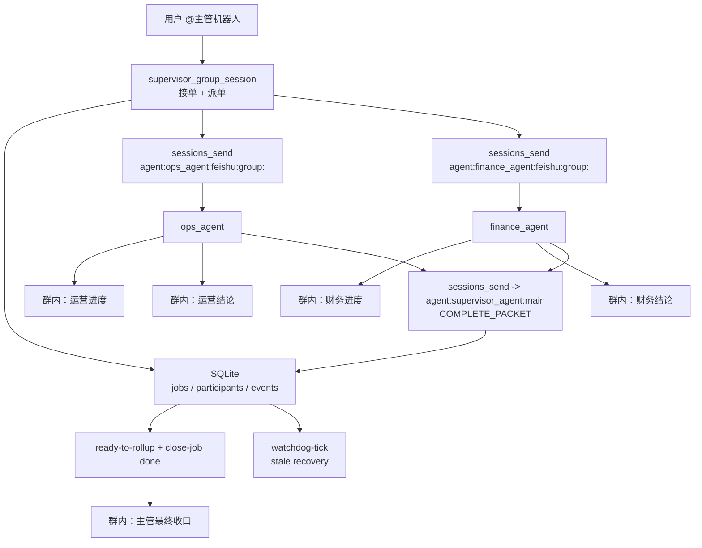

# V4.3.1 单群生产稳定版（推荐）

## 这版已经验证了什么

`V4.3.1` 已经在真实 Feishu 单群里验证通过：

1. 用户只需要 `@主管机器人` 自然语言发任务，不需要手写 `taskId`
2. `supervisor_agent` 自动生成内部 `jobRef`，并写入 SQLite 状态层
3. `ops_agent` 与 `finance_agent` 在群里真实发可见消息，而不是只在内部 session 执行
4. `supervisor_agent` 最终自动统一收口，并把任务推进到 `done`
5. 群里不再泄漏 `ACK_READY / REPLY_SKIP / COMPLETE_PACKET` 这类内部协议

真实验收样板：
- `jobRef`: `TG-20260307-029`
- `status`: `done`
- `ops_progress`: `om_x100b55f415d54ca8b4a251aefedbe8e`
- `ops_final`: `om_x100b55f415ec7cb0b285c5a23638f30`
- `finance_progress`: `om_x100b55f410fb0d3cb260eaa520d7198`
- `finance_final`: `om_x100b55f4108d94acb2c4d97d6c72f29`
- canary 输出：`V4_3_CANARY_OK`

## 适用场景

适合：
- 一个飞书团队群里长期运行 1 个主管机器人 + 2 个执行机器人
- 用户只希望自然说话，不希望理解 `taskId / jobRef / WARMUP`
- 既要群里看起来像团队在协作，也要有生产级可恢复能力

不适合：
- 真正跨多个业务群并行执行：优先用 `V3.1`
- 不接受 SQLite 状态层：不建议上生产

## 平台兼容策略

| 平台 | 推荐级别 | service manager | 说明 |
|---|---|---|---|
| `Linux` | 正式推荐 | `systemd --user` | 当前最稳的主路线 |
| `macOS` | 正式推荐 | `launchd` / `LaunchAgent` | 与 Linux 共用同一套协议和 SQLite |
| `Windows + WSL2` | 正式推荐 | 复用 Linux 路线 | 推荐启用 `systemd` |
| `Windows 原生` | 非默认路线 | 需单独评估 | 不默认承诺等价支持 |

平台原则：
1. `WARMUP`、`check_v4_3_canary.py`、SQLite 状态层、群内 6 类可见消息规则在三条推荐路线中保持一致。
2. 平台差异只体现在 watchdog 托管、service manager 命令和运维 SOP。
3. Windows 客户默认按 `WSL2` 交付；如果客户坚持原生 Windows，需要额外记录偏差。

## 生产架构



核心原则：
1. 控制面走 `sessions_send / SQLite / hidden main session`
2. 展示面走显式 `message`
3. 群里只保留 6 类可见消息
4. SQLite 是唯一真相源，session 只负责传递

## 群内可见消息规则

群里只允许这 6 类消息：

1. `supervisor_agent`：`【主管已接单｜<jobRef>】...`
2. `ops_agent`：`【运营进度｜<jobRef>】...`
3. `finance_agent`：`【财务进度｜<jobRef>】...`
4. `ops_agent`：`【运营结论｜<jobRef>】...`
5. `finance_agent`：`【财务结论｜<jobRef>】...`
6. `supervisor_agent`：最终统一收口

严格禁止：
- `ACK_READY`
- `REPLY_SKIP`
- `COMPLETE_PACKET`
- `WORKFLOW_INCOMPLETE`
- `Agent-to-agent announce step.`
- 主管中间插第二条“已派单/处理中/等待中”状态播报
- worker 发“任务已接收”“等待具体执行内容”这类占位消息

## 一次性初始化

这是部署动作，不是最终用户动作。

新团队群第一次上线时，必须执行一次：

```text
@小龙虾找妈妈 WARMUP
@易燃易爆 WARMUP
```

预期返回：

```text
READY_FOR_TEAM_GROUP|agentId=ops_agent
READY_FOR_TEAM_GROUP|agentId=finance_agent
```

说明：
- 这一步的目的是创建 worker 的 team session
- 日常使用不需要重复做
- 只有在清理 team session、重建环境、迁移群之后才需要重新初始化

## SQLite 状态层

推荐路径：

```text
~/.openclaw/workspace-supervisor_agent/.openclaw/team_jobs.db
```

最小表结构：
- `jobs`
- `job_participants`
- `job_events`

当前脚本：
- `scripts/v4_3_job_registry.py`

关键命令：

```bash
python3 scripts/v4_3_job_registry.py --db ~/.openclaw/workspace-supervisor_agent/.openclaw/team_jobs.db init-db
python3 scripts/v4_3_job_registry.py --db ~/.openclaw/workspace-supervisor_agent/.openclaw/team_jobs.db begin-turn --group-peer-id oc_f785e73d3c00954d4ccd5d49b63ef919 --stale-seconds 180
python3 scripts/v4_3_job_registry.py --db ~/.openclaw/workspace-supervisor_agent/.openclaw/team_jobs.db get-active --group-peer-id oc_f785e73d3c00954d4ccd5d49b63ef919
python3 scripts/v4_3_job_registry.py --db ~/.openclaw/workspace-supervisor_agent/.openclaw/team_jobs.db list-queue --group-peer-id oc_f785e73d3c00954d4ccd5d49b63ef919
python3 scripts/v4_3_job_registry.py --db ~/.openclaw/workspace-supervisor_agent/.openclaw/team_jobs.db watchdog-tick --group-peer-id oc_f785e73d3c00954d4ccd5d49b63ef919 --stale-seconds 180
```

## OpenClaw 配置侧建议

### 1. 继续使用官方插件路线

- `match.channel = "feishu"`
- 官方插件：`@openclaw/feishu`

### 2. 单群 session 要显式设置 reset 策略

原因：
- 群 session 会复用
- `V4.3.1` 虽然已经有 SQLite 状态层和 hidden main session，但群 transcript 仍然需要定期切断，避免长期污染

推荐：

```json
{
  "session": {
    "reset": { "mode": "daily", "atHour": 4, "idleMinutes": 120 },
    "resetByType": {
      "group": { "mode": "idle", "idleMinutes": 120 }
    },
    "resetTriggers": ["/new", "/reset"]
  }
}
```

### 3. 展示层仍然走显式 `message`

- worker 的进度摘要和结论摘要必须显式调用 `message`
- 不依赖 announce
- `messageId` 必须写回 `COMPLETE_PACKET` 与 SQLite

### 4. 控制面继续用固定 sessionKey

固定键：

```text
agent:ops_agent:feishu:group:<peerId>
agent:finance_agent:feishu:group:<peerId>
agent:supervisor_agent:main
```

不要再使用：
- `label`
- `feishu:chat:...`
- `[[reply_to_current]] COMPLETE_PACKET`

### 5. hidden main session 是正式状态对象

`agent:supervisor_agent:main` 不是临时调试通道，而是生产链路的一部分。
它负责：
- 接收 worker 的 `COMPLETE_PACKET`
- `mark-worker-complete`
- `ready-to-rollup`
- `get-job`
- 最终收口
- `close-job done`

所以在以下变更后，必须把它纳入清理范围：
- 改 `COMPLETE_PACKET` 字段
- 改 `callbackSessionKey`
- 改 `mark-worker-complete`
- 改 supervisor hidden main 的协议

## 主管 Agent 最终规则

### 1. 群会话（可见会话）

主管群会话只负责：
1. `begin-turn`
2. `start-job / append-note`
3. 发接单消息
4. 派 `TASK_DISPATCH` 给 `ops_agent` / `finance_agent`
5. 最后输出 `NO_REPLY`

硬约束：
- 第一条 assistant 必须进入工具链，禁止先发解释性文本
- 主管所有群内可见消息都必须通过 `message` 工具发送
- 禁止 `[[reply_to_current]]`
- 禁止自编 `JOB-*`，`jobRef` 只能来自 registry toolResult
- 只能用完整 `sessionKey`：

```text
agent:ops_agent:feishu:group:oc_f785e73d3c00954d4ccd5d49b63ef919
agent:finance_agent:feishu:group:oc_f785e73d3c00954d4ccd5d49b63ef919
agent:supervisor_agent:main
```

### 2. 隐藏控制会话（`agent:supervisor_agent:main`）

隐藏会话只负责：
1. 消费 `COMPLETE_PACKET`
2. `mark-worker-complete`
3. `ready-to-rollup`
4. `get-job`
5. 发最终统一收口
6. `close-job done`

硬约束：
- 若 user 文本以 `COMPLETE_PACKET|` 开头，下一条 assistant 必须先产生真实 `toolCall`
- 对 `ACK_READY / REPLY_SKIP / ANNOUNCE_SKIP / 接单镜像` 一律只输出 `NO_REPLY`
- 收到两份有效 `COMPLETE_PACKET` 后必须自动收口，不允许停在 `active`

## worker Agent 最终规则

收到 `TASK_DISPATCH|...` 后，worker 必须严格按顺序执行：

1. `message` 发进度摘要
2. 读取真实 `progressMessageId`
3. `message` 发完整结论摘要
4. 读取真实 `finalMessageId`
5. `sessions_send` 到 `callbackSessionKey=agent:supervisor_agent:main`
6. 发送单行 `COMPLETE_PACKET`
7. 最后一条只输出 `NO_REPLY`

### 可见消息格式

运营：
```text
【运营进度｜<jobRef>】<1-2句真实进度摘要>
【运营结论｜<jobRef>】<可多行完整结论，不限制字数>
```

财务：
```text
【财务进度｜<jobRef>】<1-2句真实进度摘要>
【财务结论｜<jobRef>】<可多行完整结论，不限制字数>
```

### 完成包格式

唯一有效格式：

```text
COMPLETE_PACKET|jobRef=<jobRef>|agent=<ops_agent或finance_agent>|progressMessageId=<id>|finalMessageId=<id>|summary=<120字内>|details=<400字内>|risks=<160字内>|dependencies=<160字内>|conflicts=<none或160字内>
```

严格禁止：
- `[[reply_to_current]] COMPLETE_PACKET`
- 旧字段名：`agentId / progressMsgId / finalMsgId / note`
- 伪造 `messageId`
- 在拿到两个真实 `messageId` 前直接 `NO_REPLY`

## 跨平台部署补充

### Linux / WSL2

- OpenClaw：继续使用 `openclaw gateway restart`
- watchdog：使用 `templates/systemd/v4-3-watchdog.service` 与 `templates/systemd/v4-3-watchdog.timer`
- 建议启用：

```bash
systemctl --user daemon-reload
systemctl --user enable --now v4-3-watchdog.timer
systemctl --user status v4-3-watchdog.timer
```

### macOS

- OpenClaw：继续使用 `openclaw gateway restart`
- watchdog：使用 `templates/launchd/v4-3-watchdog.plist`
- 建议启用：

```bash
mkdir -p ~/Library/LaunchAgents ~/.openclaw/logs
cp skills/openclaw-feishu-multi-agent-deploy/templates/launchd/v4-3-watchdog.plist ~/Library/LaunchAgents/bot.molt.v4-3-watchdog.plist
launchctl bootout gui/$(id -u) ~/Library/LaunchAgents/bot.molt.v4-3-watchdog.plist 2>/dev/null || true
launchctl bootstrap gui/$(id -u) ~/Library/LaunchAgents/bot.molt.v4-3-watchdog.plist
launchctl print gui/$(id -u)/bot.molt.v4-3-watchdog
```

### Windows + WSL2

- OpenClaw 建议安装在 Ubuntu LTS 的 WSL2 里
- `~/.openclaw`、SQLite、watchdog 都放在 WSL2 内部文件系统
- 额外参考：`references/windows-wsl2-deployment-notes.md` 与 `templates/windows/wsl.conf.example`

## watchdog 规则

`active job` 超过阈值未更新时：

1. 如果两边都完成且具备 `progressMessageId + finalMessageId`
- 返回 `ready_pending_rollup`
- 等隐藏控制会话收口

2. 如果只完成一边或都没完成
- 标记当前 job `failed`
- 自动释放并提升队列中的下一条 `queued`

推荐：
- 每 1 分钟执行一次 `watchdog-tick`
- `staleSeconds=180`

## 正式测试提示词（短版）

```text
@奥特曼 启动本群高级团队模式：

我们要做一轮“视频号直播 + 私域转化”的 4 月签约冲刺。
目标：20 天新签 30 家；预算不超过 8 万；毛利率不低于 40%；账期不超过 30 天。

请你：
1) 先拆分任务
2) 让运营先发进度，再发活动打法结论
3) 让财务先发进度，再发预算与 ROI 结论
4) 如果两方冲突，组织 1 轮互审
5) 最后由你统一给出执行方案、责任分工、明日三件事、风险预案
```

## 真实业务演示提示词（产品版）

```text
@奥特曼 我们准备给“企业微信私域代运营服务”做一轮 4 月签约冲刺。
目标：20 天新签 30 家；预算不超过 8 万；毛利率不低于 40%；账期不超过 30 天。

请启动本群高级团队模式：
- 运营先发进度，再发活动打法结论
- 财务先发进度，再发预算与 ROI 结论
- 如有冲突组织 1 轮互审
- 最后由你统一给出执行方案、责任分工、明日三件事、风险预案
```

## canary 验收

```bash
python3 skills/openclaw-feishu-multi-agent-deploy/scripts/check_v4_3_canary.py \
  --db ~/.openclaw/workspace-supervisor_agent/.openclaw/team_jobs.db \
  --job-ref TG-20260307-029 \
  --session-root ~/.openclaw/agents \
  --require-visible-messages
```

通过标准：
1. job `status=done`
2. `ops_agent` 与 `finance_agent` 都有真实 `progress_message_id` 与 `final_message_id`
3. session jsonl 能找到 4 个真实 `messageId`
4. canary 不再发现 `ACK_READY / REPLY_SKIP / COMPLETE_PACKET / WORKFLOW_INCOMPLETE` 外泄
5. 主管最终已自动收口

真实通过输出：

```text
V4_3_CANARY_OK: jobRef=TG-20260307-029 title=4月签约冲刺：视频号直播+私域转化 status=done ops_progress=om_x100b55f415d54ca8b4a251aefedbe8e ops_final=om_x100b55f415ec7cb0b285c5a23638f30 finance_progress=om_x100b55f410fb0d3cb260eaa520d7198 finance_final=om_x100b55f4108d94acb2c4d97d6c72f29
```

## Codex 真实交付模板（V4.3.1，完整可执行版）

```text
请使用 openclaw-feishu-multi-agent-deploy skill，按 V4.3.1 单群生产稳定版完成交付。

目标：
- 用户只需在同一个飞书群里 @主管机器人，自然语言发任务。
- supervisor 自动生成内部 jobRef，不要求用户手写 taskId。
- 群里可见顺序固定为：主管接单 -> 运营进度 -> 财务进度 -> 运营结论 -> 财务结论 -> 主管最终收口。
- 群里不得暴露 ACK_READY / REPLY_SKIP / COMPLETE_PACKET / WORKFLOW_INCOMPLETE。
- worker 的内部回调统一进入 agent:supervisor_agent:main，由隐藏控制会话推进 SQLite 状态机并最终收口。
- 单群只允许一个 active job；新任务入队；stale job 由 watchdog 自动释放。
- 运营与财务的结论摘要允许多行完整输出，不再压成一句话。

输入：
- platform:
  - target: "linux" # linux | macos | wsl2
  - serviceManager: "systemd-user" # systemd-user | launchd
- teamGroupPeerId: "<真实团队群 peerId>"
- supervisorAccountId: "<主管机器人 accountId>"
- opsAccountId: "<运营机器人 accountId>"
- financeAccountId: "<财务机器人 accountId>"
- sqliteDbPath: "~/.openclaw/workspace-supervisor_agent/.openclaw/team_jobs.db"
- staleSeconds: 180
- watchdogEnabled: true
- accountMappings:
  - { accountId: "aoteman", appId: "cli_a923c749bab6dcba", appSecret: "TWpD207Ri2g1Qqmw4R5YhfkPRhOokCGX", encryptKey: "", verificationToken: "" }
  - { accountId: "xiaolongxia", appId: "cli_a9f1849b67f9dcc2", appSecret: "g7dTIRe6Tz8jYzASSKTT2eBV5LGzrKDr", encryptKey: "", verificationToken: "" }
  - { accountId: "yiran_yibao", appId: "cli_a923c71498b8dcc9", appSecret: "swscrlPKYCwAehOyyoLrlesLTsuYY6nl", encryptKey: "", verificationToken: "" }
- agents:
  - { id: "supervisor_agent", role: "主管总控" }
  - { id: "ops_agent", role: "运营执行" }
  - { id: "finance_agent", role: "财务执行" }
- routes:
  - { peerKind: "group", peerId: "<真实团队群 peerId>", accountId: "aoteman", agentId: "supervisor_agent" }
  - { peerKind: "group", peerId: "<真实团队群 peerId>", accountId: "xiaolongxia", agentId: "ops_agent" }
  - { peerKind: "group", peerId: "<真实团队群 peerId>", accountId: "yiran_yibao", agentId: "finance_agent" }

约束：
1) 先审计现有 ~/.openclaw/openclaw.json，输出 to_add / to_update / to_keep_unchanged。
2) 只修改和本次单群生产版直接相关的项：
   - channels.feishu.accounts.*.groups[teamGroupPeerId]
   - supervisor/ops/finance workspace 身份文件
   - SQLite registry 脚本
   - watchdog 配置（如本次启用）
3) supervisor 群会话只负责接单与派单；最终收口必须走隐藏控制会话自动触发。
4) 必须显式配置和说明 hidden main session：agent:supervisor_agent:main。
5) worker 的 COMPLETE_PACKET 只能使用固定单行格式，不允许 JSON、不允许旧字段名。
6) worker 必须严格执行：message(progress) -> message(final) -> sessions_send(COMPLETE_PACKET) -> NO_REPLY。
7) 群内结论允许多行完整输出；群内进度只保留 1 条摘要。
8) 必须输出 group session reset 策略，避免旧 transcript 长期污染。
9) 若目标平台是 macOS，输出 launchd 安装命令；若目标平台是 wsl2，输出 systemd --user 安装命令；不要给 Windows 原生 service 方案。
10) 上线步骤里显式加入一次性 WARMUP 前置，不要把它写成每次任务都要做。
11) 输出完整命令：
   - 备份
   - 初始化 SQLite
   - 一次性 WARMUP
   - validate
   - restart
   - watchdog
   - canary
   - rollback
12) 最后输出“真实用户使用示例”：用户不写 taskId，只自然发任务；然后展示系统如何自动生成 jobRef。
13) 最后输出“部署后测试顺序”：先发什么，再发什么，再跑什么命令，每一步的预期效果是什么。
```

## 部署后测试顺序（必须写给客户和 Codex）

### 一、初始化阶段

先在团队群做一次性初始化：

```text
@小龙虾找妈妈 WARMUP
@易燃易爆 WARMUP
```

预期：
- 运营机器人回复：`READY_FOR_TEAM_GROUP|agentId=ops_agent`
- 财务机器人回复：`READY_FOR_TEAM_GROUP|agentId=finance_agent`

说明：
- 这是部署动作，不是日常用户动作
- 同一个团队群只在首次上线、清 session、迁移环境后需要重做

### 二、正式任务测试

推荐先发短版测试词：

```text
@奥特曼 启动本群高级团队模式：

我们要做一轮“视频号直播 + 私域转化”的 4 月签约冲刺。
目标：20 天新签 30 家；预算不超过 8 万；毛利率不低于 40%；账期不超过 30 天。

请你：
1) 先拆分任务
2) 让运营先发进度，再发活动打法结论
3) 让财务先发进度，再发预算与 ROI 结论
4) 如果两方冲突，组织 1 轮互审
5) 最后由你统一给出执行方案、责任分工、明日三件事、风险预案
```

### 三、群里预期顺序

正确顺序必须是：

1. 主管：`【主管已接单｜TG-...】...`
2. 运营：`【运营进度｜TG-...】...`
3. 财务：`【财务进度｜TG-...】...`
4. 运营：`【运营结论｜TG-...】...`
5. 财务：`【财务结论｜TG-...】...`
6. 主管：最终统一收口

严格不应出现：
- `ACK_READY`
- `REPLY_SKIP`
- `COMPLETE_PACKET`
- `WORKFLOW_INCOMPLETE`
- 主管中间插第二条“已派单/处理中”播报
- worker 发“任务已接收/等待具体内容”

### 四、命令行验收

在 OpenClaw 主机执行：

```bash
python3 skills/openclaw-feishu-multi-agent-deploy/scripts/check_v4_3_canary.py \
  --db ~/.openclaw/workspace-supervisor_agent/.openclaw/team_jobs.db \
  --job-ref <刚才生成的 TG-...> \
  --session-root ~/.openclaw/agents \
  --require-visible-messages
```

预期：
- 返回 `V4_3_CANARY_OK`
- SQLite 中该任务 `status=done`
- `job_participants` 中运营与财务都写入了真实 `progress_message_id` 与 `final_message_id`

### 五、队列与恢复测试（可选但建议）

在第一个任务进行中，再发第二个独立任务。

预期：
- 第二个任务不会并行串到第一个任务里
- SQLite 中显示第二个任务 `status=queued`
- 若 active job stale，`watchdog-tick` 能自动释放队列

## 最小部署建议

1. 先用 `V4.3.1`，不要再从 `V4.3` 半成品起步
2. 部署后做一次 `WARMUP`
3. 立即跑一次 `check_v4_3_canary.py`
4. 通过后再给真实用户使用

一句话：

**`V4.3.1` 才是单群真实生产版；`V4.3` 只是方向定义。**
